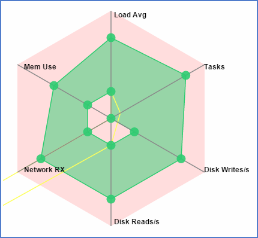

# Shipped - Define and enforce application level policies

Shipped provide us to update multi level policy for each service level with in application.

## Prerequisite

1. How to Create Project with Shipped.
2. How to Add services to project with Shipped.
3. How to create env
4. How to deploy project.

## Application Level Policies

Application level polices are the rules, that will support enhance your application durablity on running container. It help you to manage memory management, disk read and write managment, task management, network managment and load balancing.

To test CiscoShipped Create a sample program in golang, that will leak the memory and we do memory management from shipped ui for the same service, So that our app will up and running without fail.

### Steps involve

1. Fork the sample program from Cisco Cloud.
2. Create Project in Shipped.
3. Add Existing project to Shipped.
4. Build Project.
5. Create New Env
6. Deploy the successfull build to env.
7. Finally app will be up and running, Keep running app 
8. Change the Env Setting, Add New Policy to app
9. Checkout the effects.
