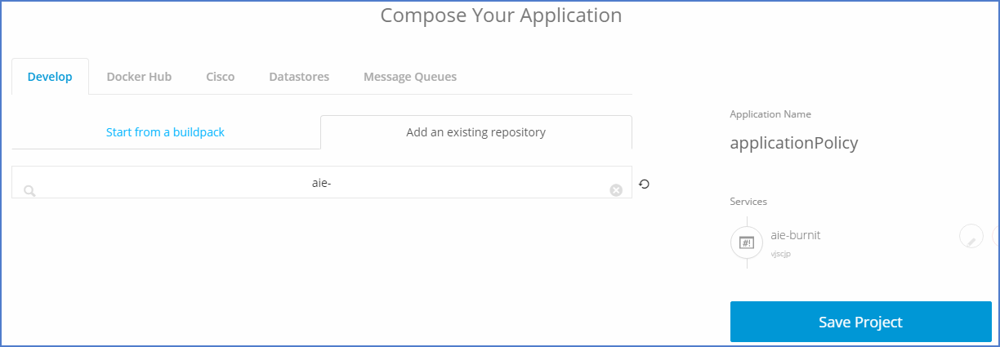
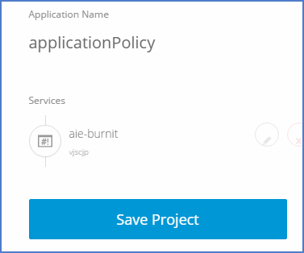

## Fork Sample Application from CiscoCloud.

### Fork aie-burnit from below link 

1) <a href="https://github.com/CiscoCloud/aie-burnit" target="_blank">aie-burnit</a>

Note : <a href="https://help.github.com/articles/fork-a-repo/#fork-an-example-repository" target="_blank">How to Fork Git Hub?</a>, Ignore if you already did.

After Fork done, Repo will be copied from CiscoCloud to your own public repo.

## Create project & Add Services in Shipped.

Project Name : "applicationPolicy"

Under <b>Develop</b> Tab > Go to <b>Add Existing Repository</b> Section > Search for aie-burnit

App highlighted repo to your project.

Project will look like this 

## Build Project 

Click on Save project that trigger build for the services that we have added.

Once build Get Complete we will Deploy.

