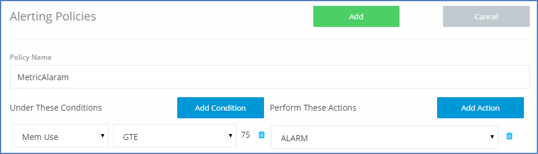
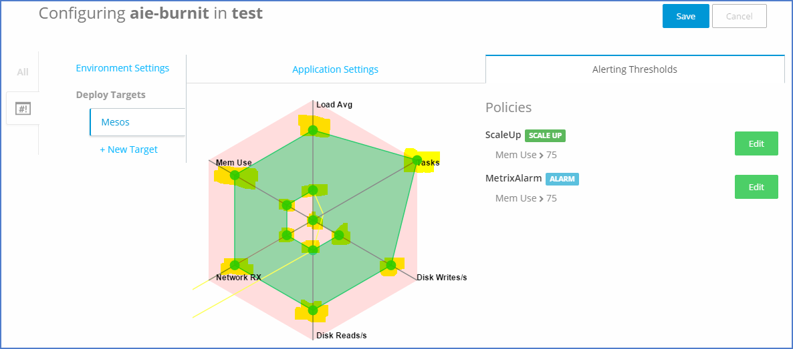

## Create Environment

Click on <b>New Environment</b>, Enter Name of Env "Test" and Save it.
Our <b>test</b> environment has been created.

## Deploy Services 

### Deploy Data Service (Postgres)

Select Successfull build for aie-burnit service from left hand side and, choose the env, that we had created "test". then click deploy. Your app started running.

Click on Env Settings and click on <b>Alerting Thresholds</b>

Scroll Down, Click on Add new Policy

### Deploy vote-api 

<b>IMP</b> : We need to set the env variable to the same env and then click on deploy button, "Don't click on deploy before setting env variable."

Again go to setting, Add new Env variables as below .

Add new env variables as given below and then save.
Note : Don't change the key value.

Click add policy, You policy get added to the service.

Policy Explanation : 

We have defined rule, which signifies that if Memory Use is greater then 75% then Scale Up the container from 1 to 2, and again, if again memory use is greater than 75% with in 2 container it will Scale up by 1 from 2 to 3 container. As we defined 3 as maximum limit so from here it will not scale up.

Lets create another policy with different condition.

Policy Explanation :

We are trying to set alaram on memory use, If Mem Use is Greater then 75% then trigger the alaram.

We can scale the percentage by moving green dot with in the spider web as show in below .

We have two set of dots, Inner green dots (highlighted) to set the minimum threshold. and Outer green dots (highlighted) to set the maximum threshold value.

As we move dots you can see that policy that we have added, value will auto update.

So let save it and go back to environment.

vote-api gets deployed 

<b>IMP</b> this will trigger and create env variable for vote-api. and 
Env variable will be HOST_VOTE_API as we need rest api end point for application so our ui application will read same env variable.

### Deploy vote-ui

*Don't deploy until your API get deployed.

We have verified that ENV variable <b>HOST_VOTE_API</b>, under setting section get created, screen given below.

.