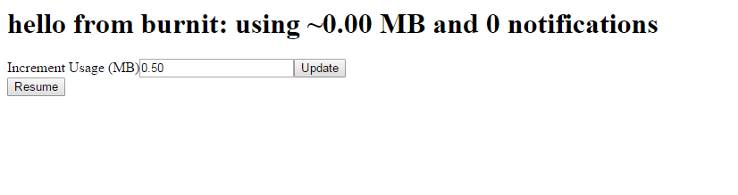
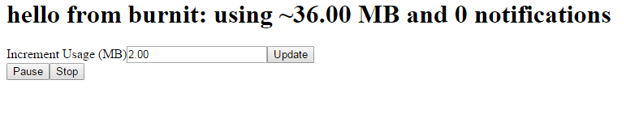
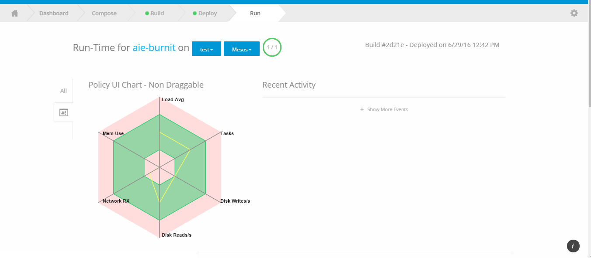
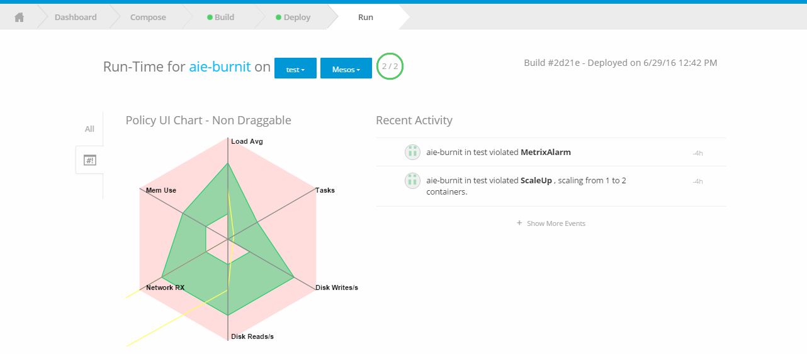
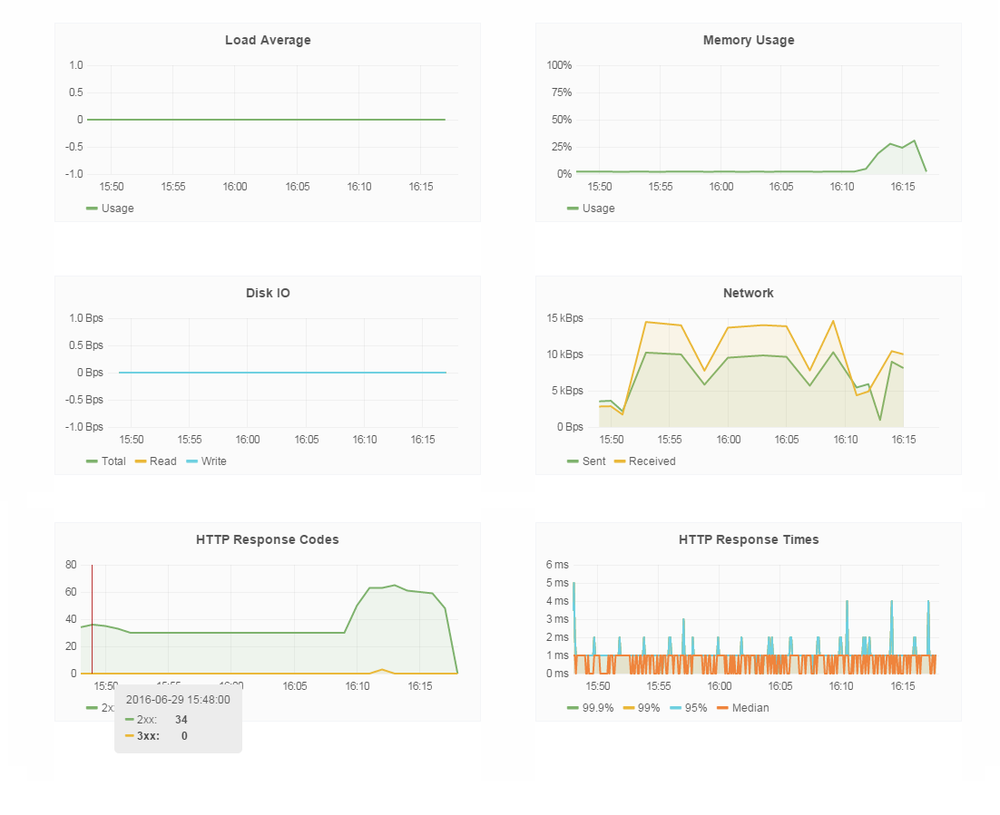

## aie-burnit Usage

We have deployed app up and running on test env.

We can specify the no of MB's by which we can start memory leak in app to see how policy response to our app.

So we are adding 2 and click on update button, once done we will click on resume (it resume app with memory leak.)

As we can see memory leak has been increasing. As Memory leak reached 75% of policy, we will get alert, in shipped ui.

We can see alert under Run page > 

After reach to threshold we have stopped memory leak and capture the below output.

Below are the related metrics graphs

