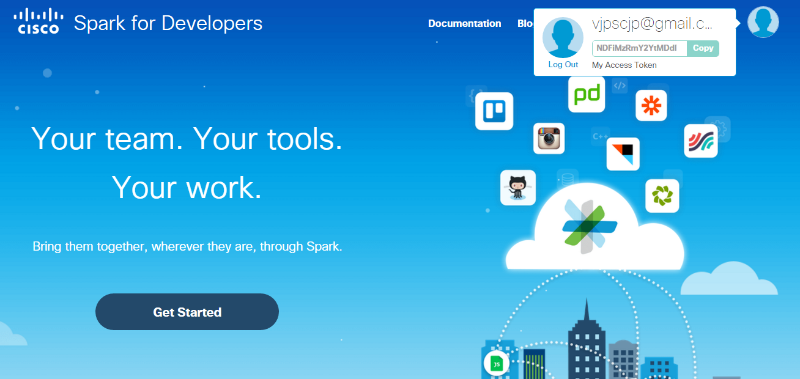
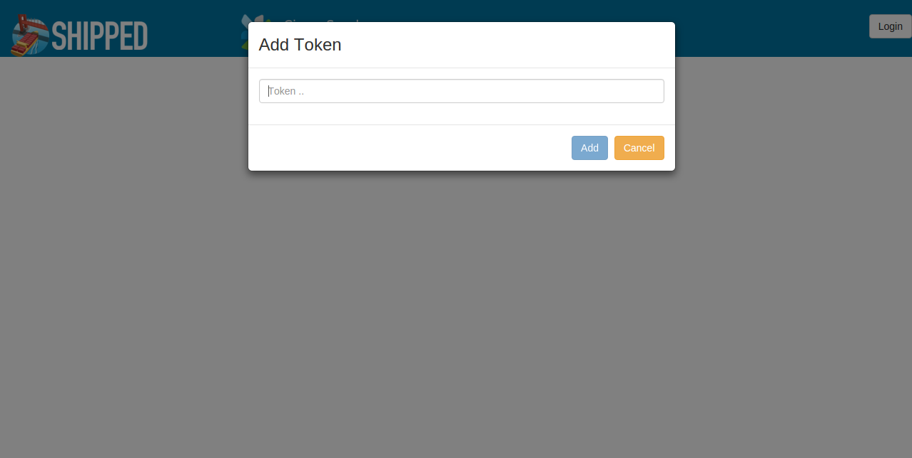
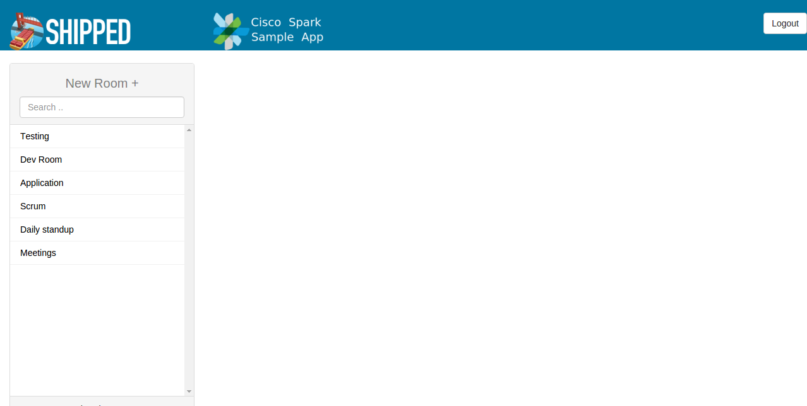

# Shipped 5 - Bootstrap Spark Project

## Introduction 
Cisco Spark helps modern teams work together. Sign in to create rooms with group messaging, content sharing, video calling, and desktop sharing.

Cisco Spark provide us rest api, using which we have create a sample application which can be used to bootstrap Spark project, to know more about sample application click on - <a href="https://github.com/CiscoCloud/shipped-buildpack-template-spark" target="_blank">Cisco Spark Buildpack Template</a>.

## Objectives
You will learn how to:
- Bootstrap Spark Sample Application using Shipped
- Completion time : 5 min approx

## Prerequisites

- Github Login Account
- Spark API token to login to Spark Application after bootstrap.

## References
- Cisco Spark: Shipped Buildpack demo video (10 min), please follow <a href="https://cisco.webex.com/cisco/ldr.php?RCID=98837d3fbf139ce537e8f11a660ccff0" target="_blank" >video link here</a>.
- Walkthrough Cisco Shipped to create, build and deploy project,<a href="http://shipped-cisco.com/shipped/api-docs/build/index.html#walkthroughs" target="_blank">click here</a>. 
- <a href="https://github.com/CiscoCloud/Shipped-Learning-Labs/blob/master/labs/shipped-quick-start/1.md" target="_blank">Quick Start with Cisco Shipped</a> reference guide. 

## To Bootstrap a project with Spark 

1. For creating Application in Shipped using Spark buildpack refer to getting started section of Shipped document: <a href="http://shipped-cisco.com/shipped/api-docs/build/index.html#walkthroughs" target="_blank">Click here</a>

Note : At service creation Step need to select "Cisco Spark" Buildpack under API tab.

	

2. Rest project creation and and deployment section will remain same, <a href="https://ciscoshipped.io/shipped/api-docs/build/index.html#5.-build-your-project" target="_blank">more detail.</a>

## How to use Sample Application

1. Once application is up and running, following screen will appear. It requires a <code>auth token</code>, which can be retrieved by logging into <a href="https://developer.ciscospark.com/" target="_blank">developer spark</a>.
    
    

2. You can paste here that copied token and loggin to application.

    
    
3. After adding a valid token to application, Sample app fetch all rooms associated from that token. 

    
    
4. Features included

-  Create New Rooms
-  Send message to any old rooms.
-  Logout from current account.

## Cisco Spark Support 
Send us an email to open a private ticket. <a href="mailto:devsupport@ciscospark.com">devsupport@ciscospark.com</a>
Or You can also join our spark room **#spark4devs**