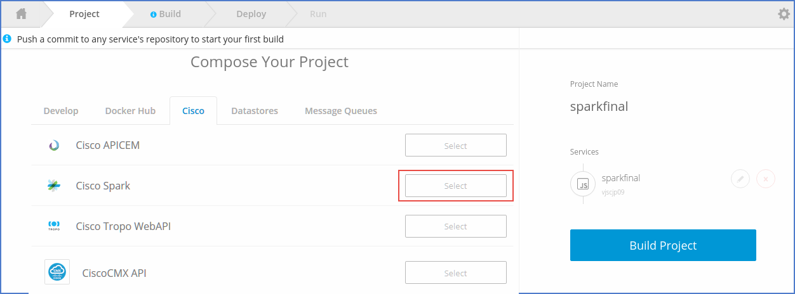

# Shipped 5 - Bootstrap Spark Project

## Introduction 
Cisco Spark helps modern teams work together. Sign in to create rooms with group messaging, content sharing, video calling, and desktop sharing.

Cisco Spark provides  us developer platform using rest api with which we have created a sample  application. To know more click on - <a href="https://github.com/CiscoCloud/shipped-buildpack-template-spark" target="_blank">Cisco Spark Buildpack Template</a>.

## Objectives
You will learn how to:
- Bootstrap Spark Sample Application using Shipped
- Completion time : 10 min approx

## Prerequisites

- Github Login Account
- Spark API token to login to our sample Spark app, after bootstrap.

## References
- Cisco Spark: Shipped Buildpack demo video (10 min), please follow <a href="https://cisco.webex.com/cisco/ldr.php?RCID=98837d3fbf139ce537e8f11a660ccff0" target="_blank" >video link here</a>.
- Walkthrough Cisco Shipped to create, build and deploy project,<a href="http://shipped-cisco.com/shipped/api-docs/build/index.html#walkthroughs" target="_blank">click here</a>. 
- <a href="https://github.com/CiscoCloud/Shipped-Learning-Labs/blob/master/labs/shipped-quick-start/1.md" target="_blank">Quick Start with Cisco Shipped</a> reference guide. 

## To Bootstrap a project with Spark 

1. We need to create project in Shipped using Spark buildpack, refer to Getting Started section of Shipped document: <a href="http://shipped-cisco.com/shipped/api-docs/build/index.html#walkthroughs" target="_blank">Click here</a>

Note : We need to make a small change at service creation step, just select "Cisco Spark" Buildpack under API tab.

Rest project creation and deployment section will remain same, <a href="https://ciscoshipped.io/shipped/api-docs/build/index.html#5.-build-your-project" target="_blank">more detail.</a>

**next** : How to use sample app.
