# Shipped - CICD

1 Compose Project

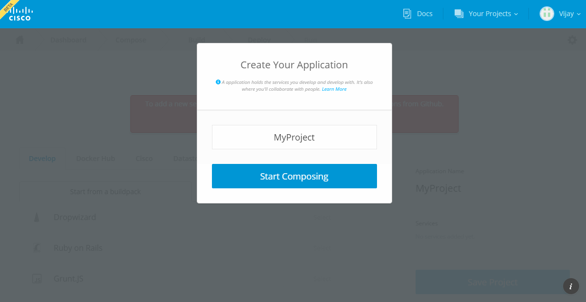

2 Add Service (Golang for Eg.)

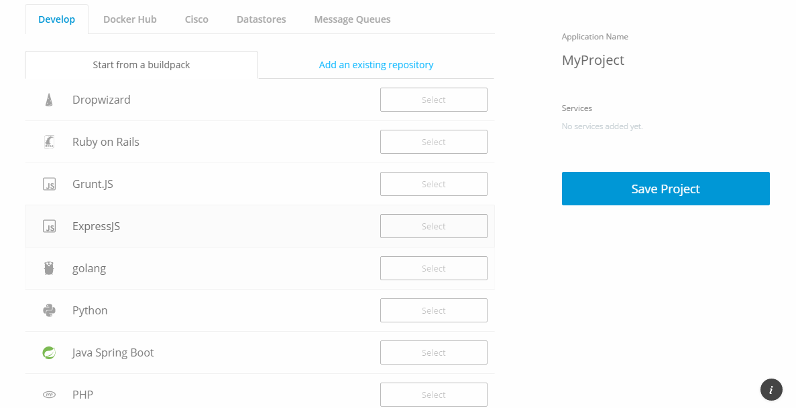

3 Provide Service name 

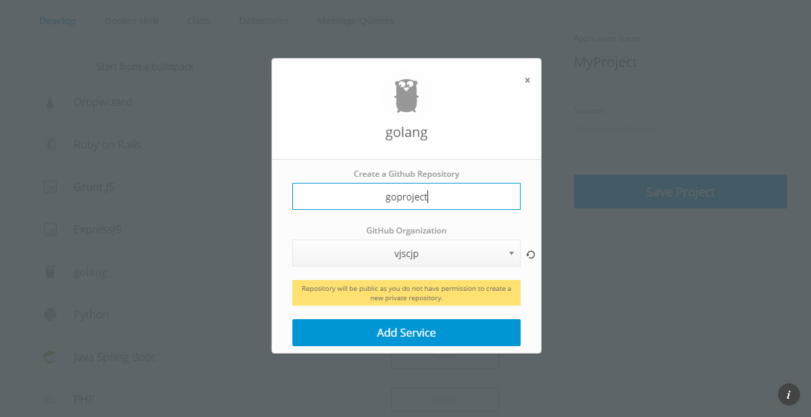

4 Save Project

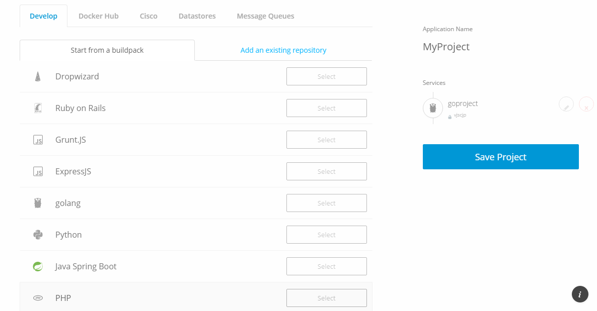

5 Verify First build

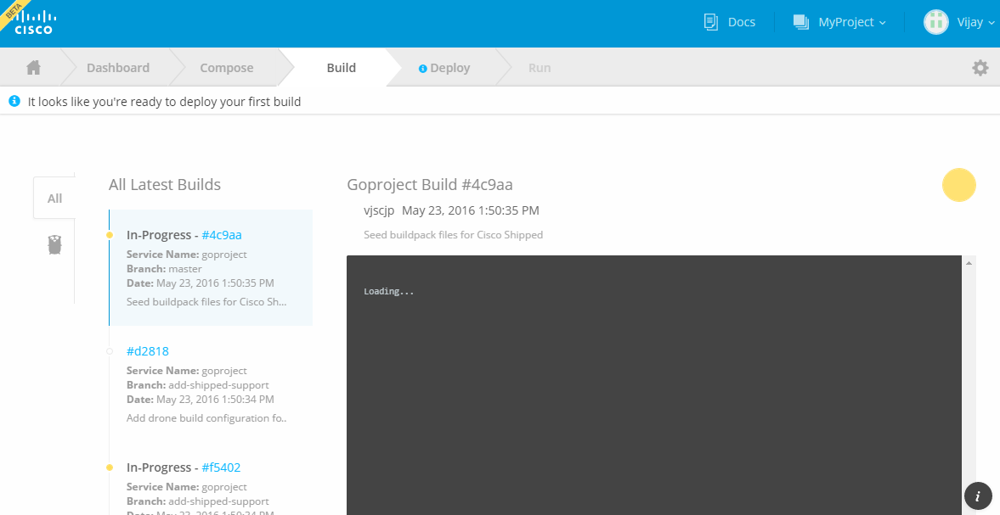

6 Verify Git Project

7 Make Some Changes in git Project

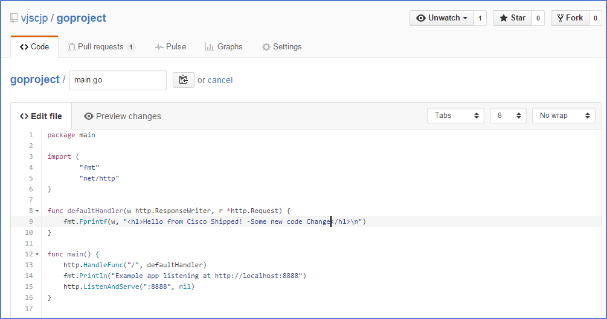

8 Commit changes

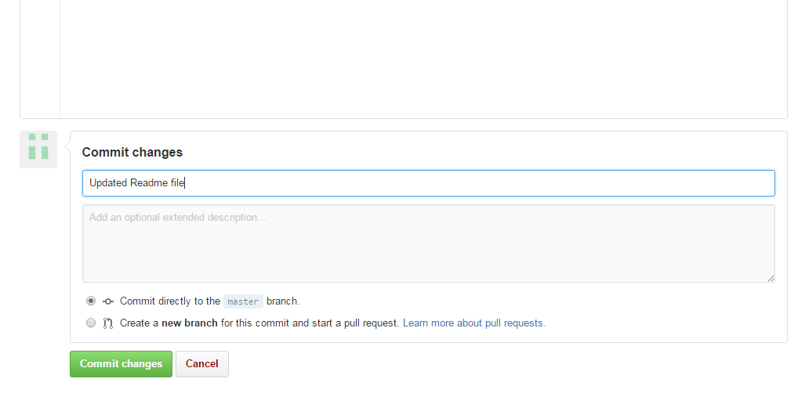

9 Verify Build progress for latest commit

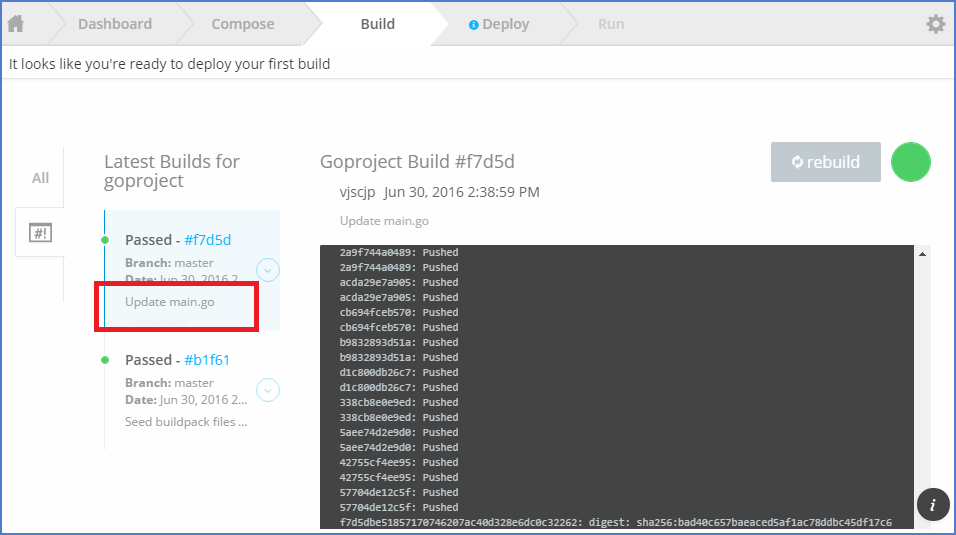

10 Create Deployment Environment

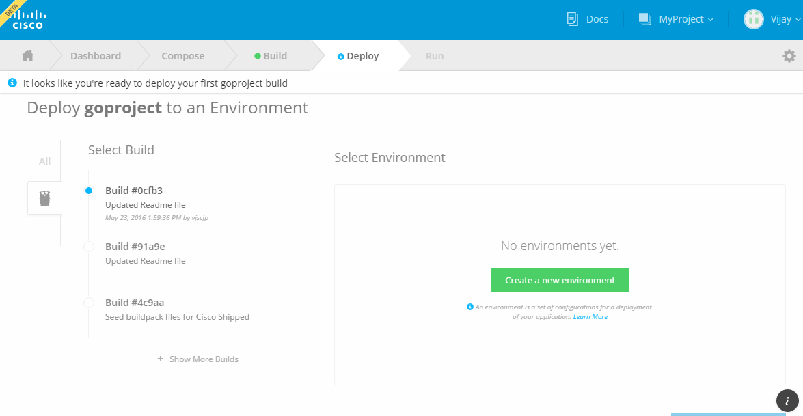

11 Save Environment

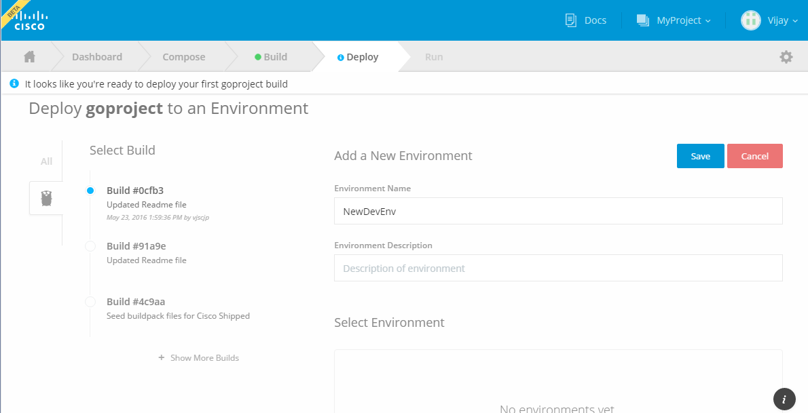

12 Deploy Build to new Environment

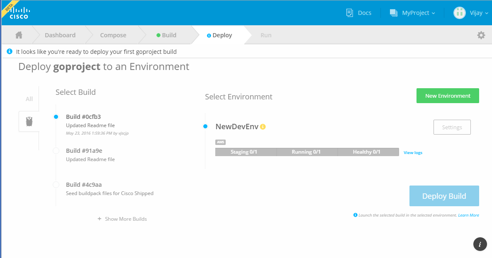

13 Make Enviroment for Auto Deploy on successfull build

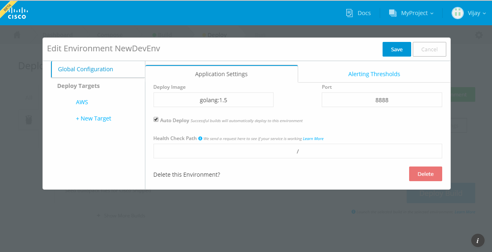
