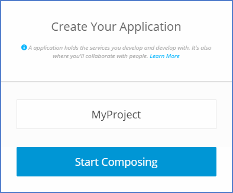
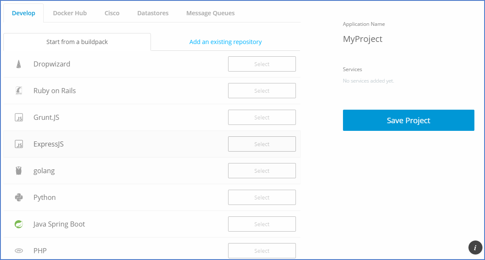
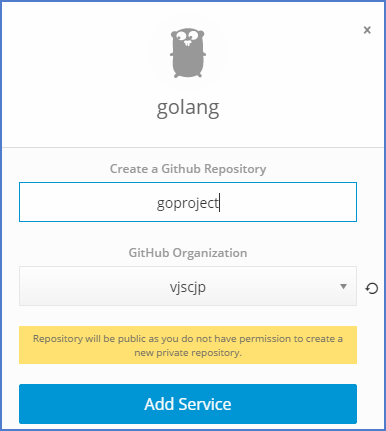
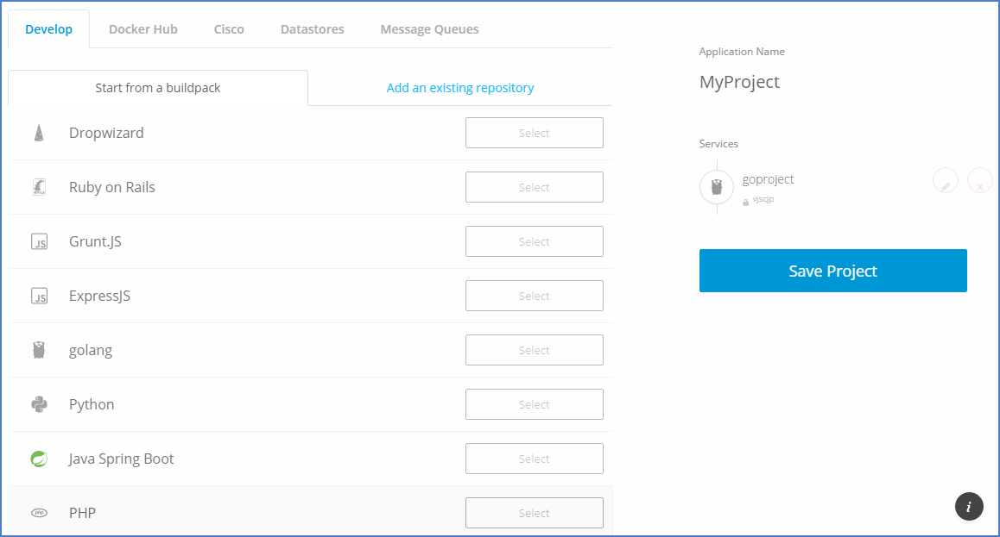
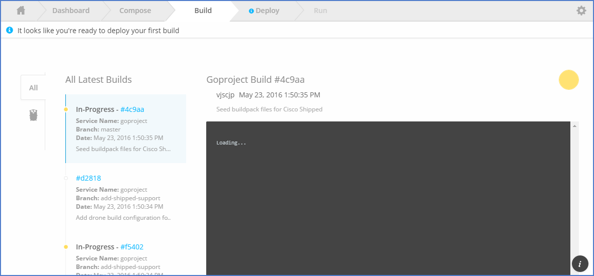
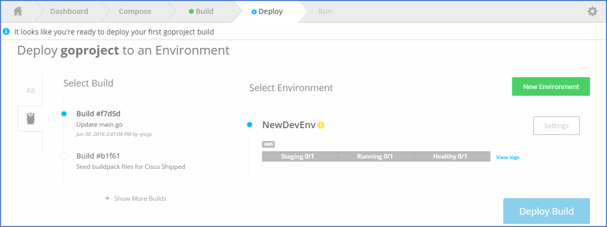
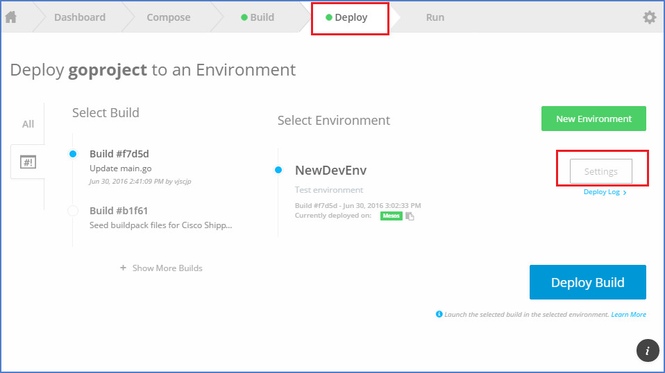

# Shipped - CICD

1 Compose Project

2 Add Service (Golang for Eg.)

3 Provide Service name 

4 Save Project

5 Verify First build

6 Verify Git Project

7 Make Some Changes in git Project

8 Commit changes

9 Verify Build progress for latest commit

10 Create Deployment Environment

11 Save Environment

12 Deploy Build to new Environment

13 Make Enviroment for Auto Deploy on successfull build

