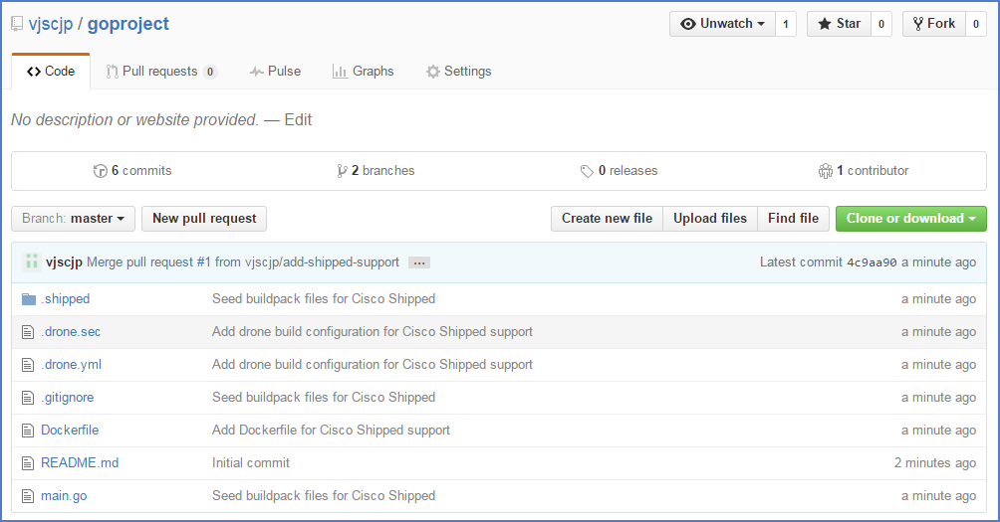
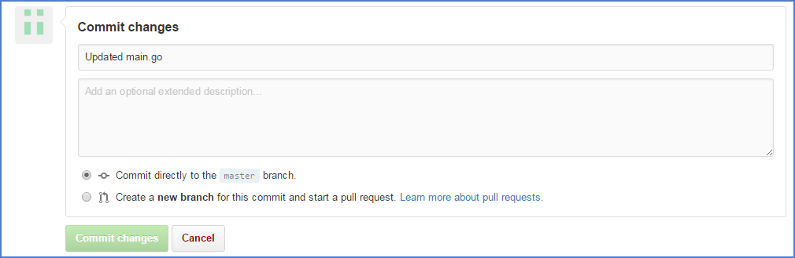
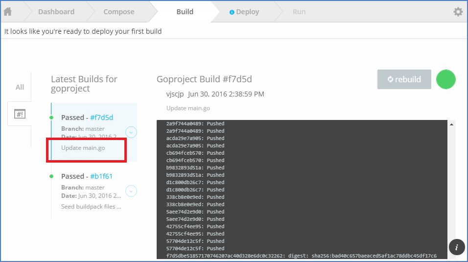
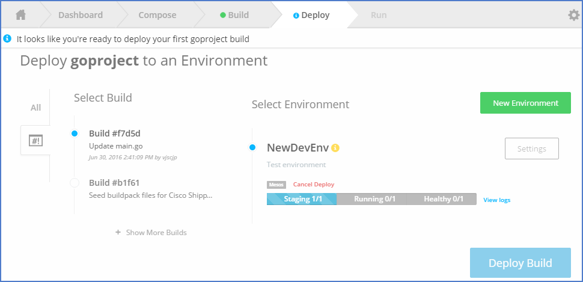

# Shipped - CICD

1 Verify Git Project- Now you should be able to see fully integrated git repo with all neccesory changes done by shipped.

2 Make Some Changes in your git Project to see if shipped triggers a new build for your commit.

3 Commit changes- once you commit your change associated webhook will tell shipped to trigger a build for your commits. Each Commit will trigger a seperate build.

4 Verify Build progress for latest commit

5 Create Deployment Environment

6 Save Environment

