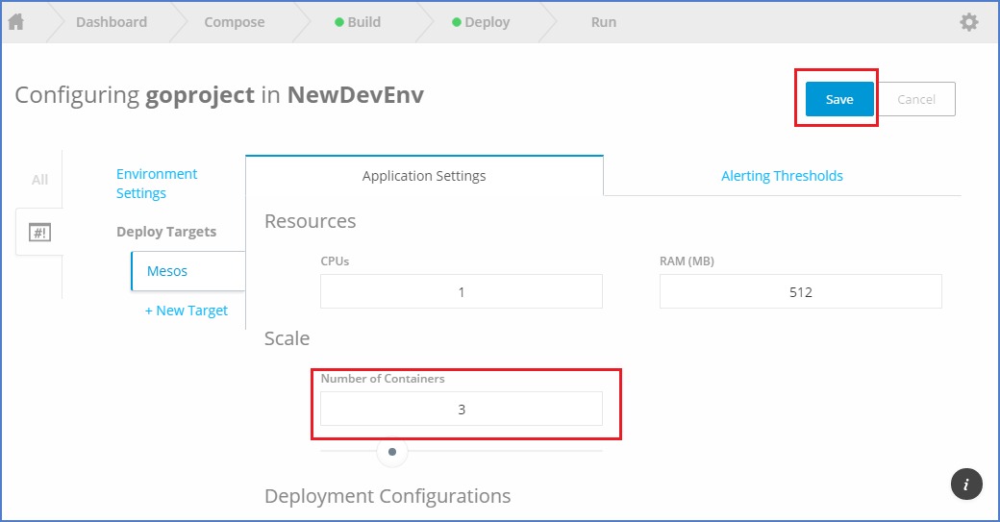
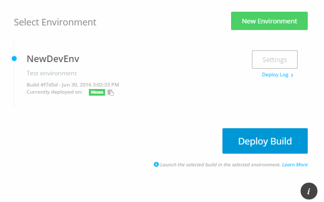

# Shipped - CICD

1 Deploy Build to new Environment

2 Make Enviroment for Auto Deploy on successfull build

Global Configurations

Deployment Target Specific Configurations.

Note : If we change any of the configuration setting here like CPU count, Update Enviroment Variables we need to redeploy our successfull build.

3 Once done with Enviroment specific setting, We need to redeploy build.

Deploying a build to an environment means that your project will be deployed to the environment you select. It replaces any previous deployment of the build to that environment. 

4 When the project deployment is completed, we can see URL in green color link like "CISCO EU" for    the build, and progress bar also disappears.

 
Wow, You have successfully built and deployed your project with custom environment settings.

