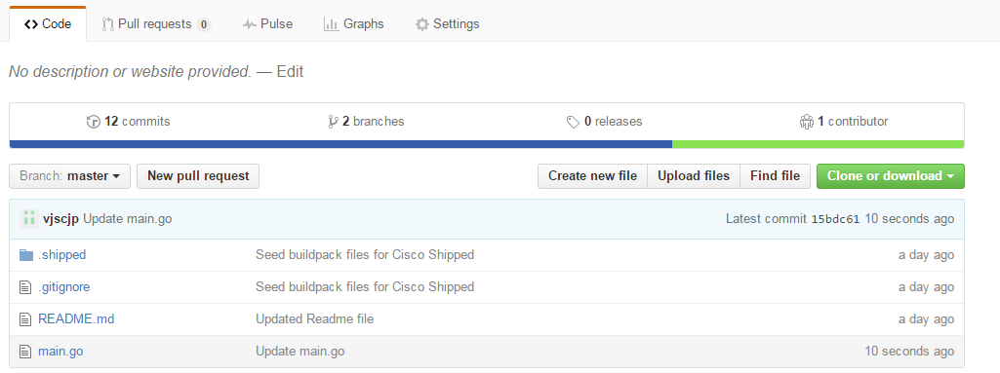
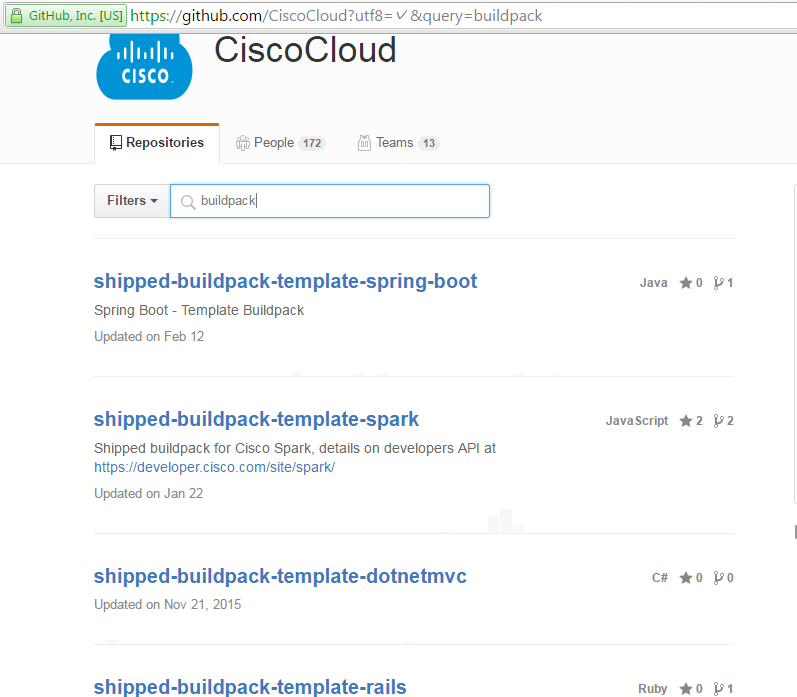
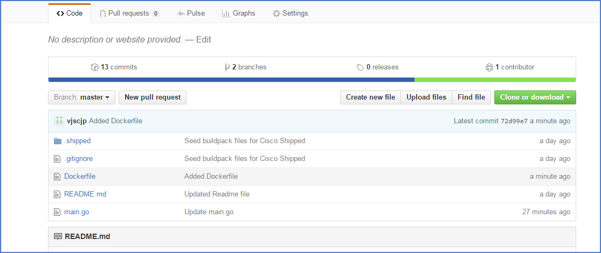
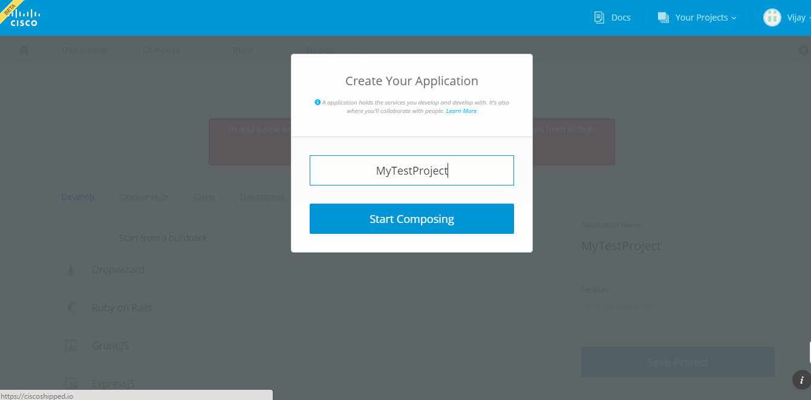
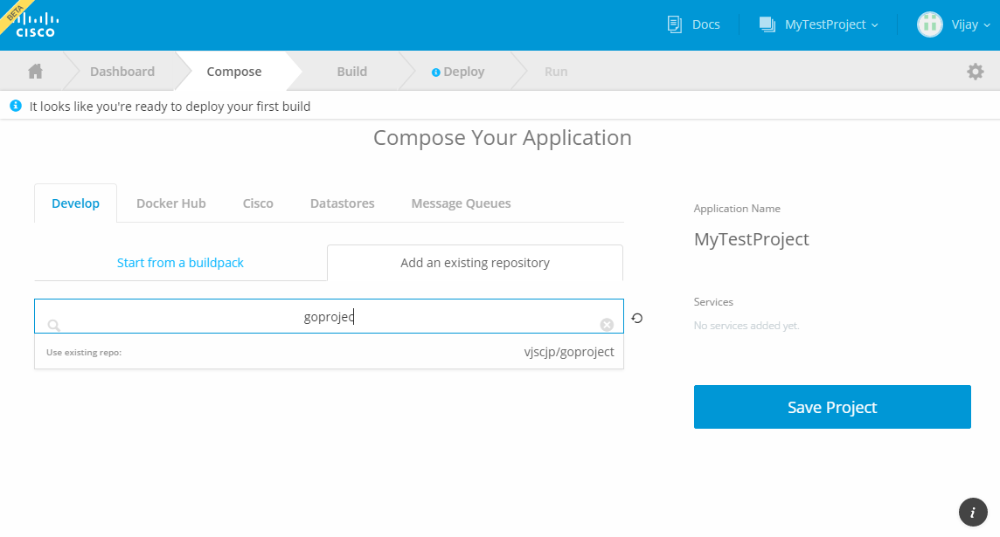
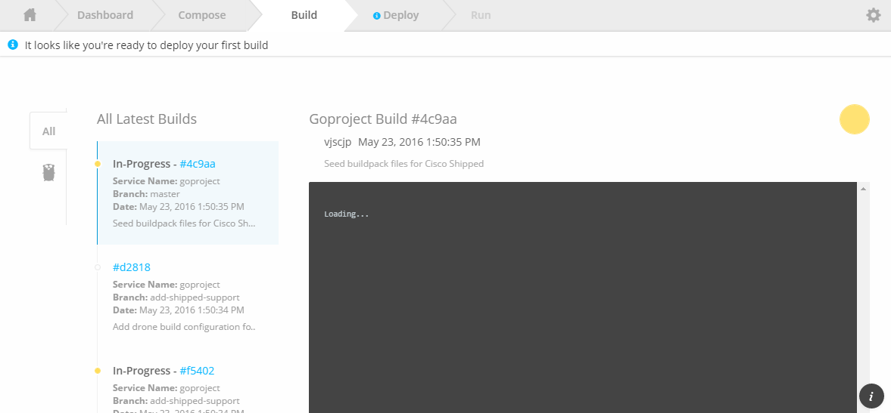
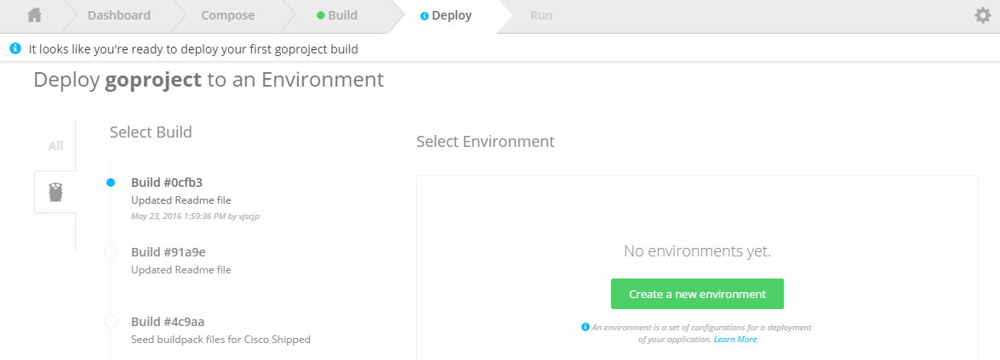
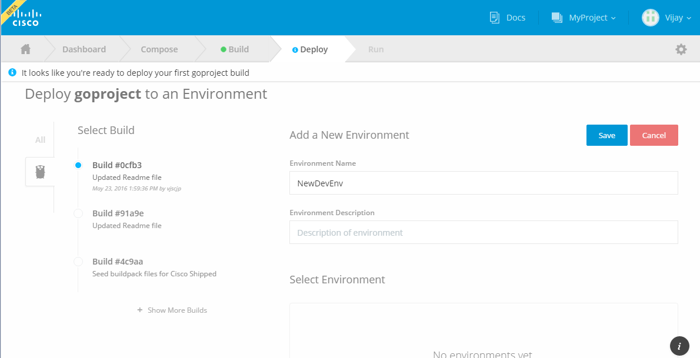
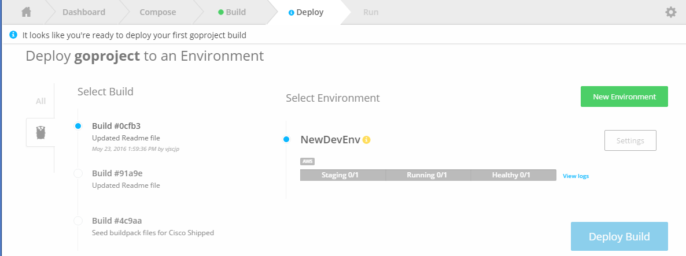

# Shipped - Import Existing project to shipped

1 Choose Exiting Project



2 Create a Docker file- This section is Specific to the type of project (Example project is in Golang)
For Example:
```Dockerfile
FROM golang:1.5
EXPOSE 8888
WORKDIR /go/src/app
COPY . /go/src/app

RUN chmod a+x .shipped/build .shipped/run .shipped/test

RUN [".shipped/build"]
CMD .shipped/run
```



3 Add docker file to existing repository



4 Compose a new project



5 Select repo from existing repo



6 Select repo and save project.


7 Check Build logs 



8 Create new deployment environment



9 Save New deployment environment



10 Deploy build to this new environment


 
