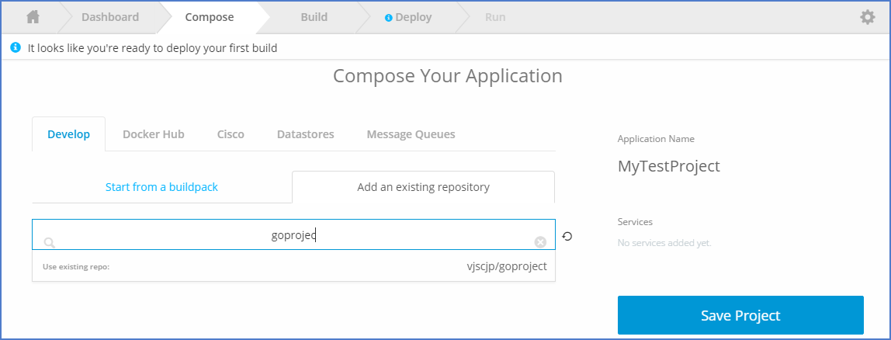

# Shipped - Import Existing project to shipped

1 Choose Exiting Project


2 Create a Docker file- This section is Specific to the type of project (Example project is in Golang)
For Example:
```Dockerfile
FROM golang:1.5
EXPOSE 8888
WORKDIR /go/src/app
COPY . /go/src/app

RUN chmod a+x .shipped/build .shipped/run .shipped/test

RUN [".shipped/build"]
CMD .shipped/run
```


3 Add docker file to existing repository


4 Compose a new project


5 Select repo from existing repo



6 Select repo and save project.


7 Check Build logs 


8 Create new deployment environment


9 Save New deployment environment


10 Deploy build to this new environment


 
