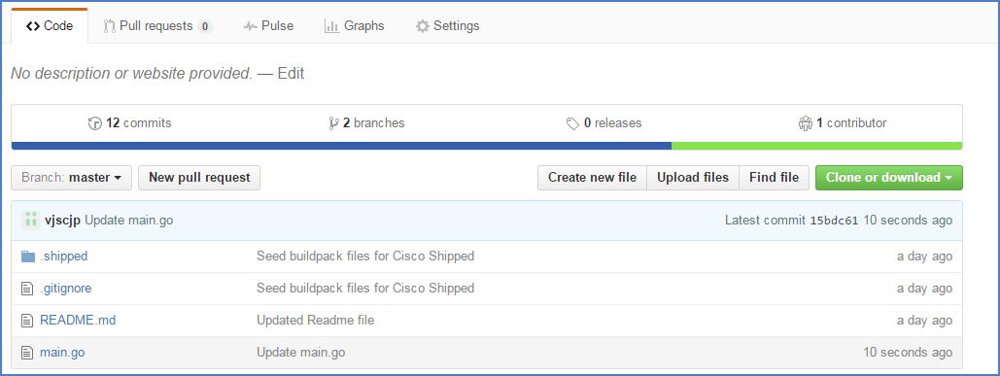

# Shipped - Import Existing project to shipped
Shipped-UI provides capability to Integrate your existing code to shipped in few simple steps.

In many cases you might have working code ready, you may just want to integrate your project to shipped. you can simply select your git repo that you want to integrate with shipped.

1 Choose Exiting Project
You can select your git repo you want to integrate with shipped, For this example we have sample project 'goproject' written in golang. 



1.1 If you have not started your development yet and you are thinking to creating new git project we recommend you fork sample go code from using this link https://github.com/CiscoCloud/shipped-buildpack-template-golang#fork-destination-box. Now your git repo is ready have golang hellow-world source code, you can start your import this repository for this learning lab.

2 Create a Docker file- This section is specific to the type of project (this project is in Golang)

To Integrate your project with shipped you need to have Docker file. this docker file content varies depend on your project requirement.

For Example:
```Dockerfile
# Base Image for Golang Project types.
FROM golang:1.5
# Port number to expose from docker container to host server.
EXPOSE 8888     
# Workspace directory path where your code exists
WORKDIR /go/src/app  
# Copy source from host machine to docker container.
COPY . /go/src/app   

 # provide your build/Run command.
RUN ["go build"]
CMD ./Binary_file_name
```

[Read More about Dockerfile](https://docs.docker.com/engine/reference/builder/)

3 Add this docker file to your existing repository


<a href="2.md">NEXT</a>
