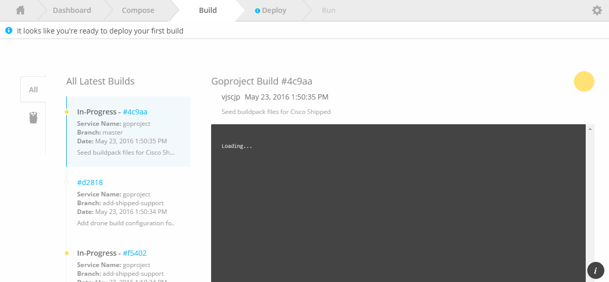
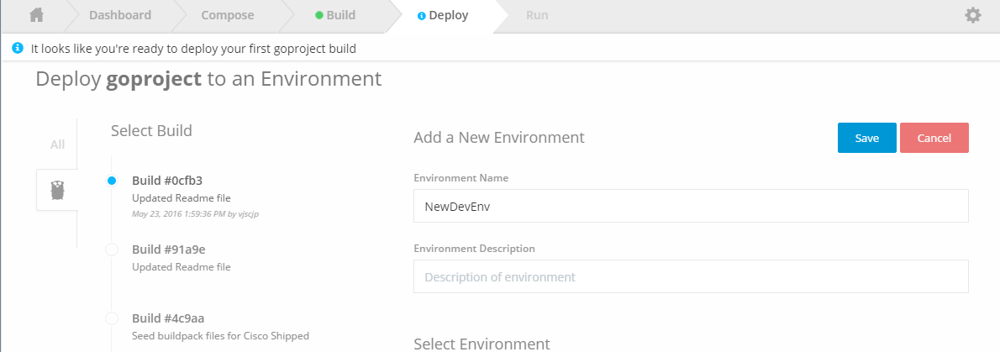

# Shipped - Import Existing project to shipped

1 Check Build logs, your should be able to check build in progress for shipped commits to your repo during "Save Project"

2 Create new deployment environment

3 Save New deployment environment

4 Deploy build to this new environment

 
