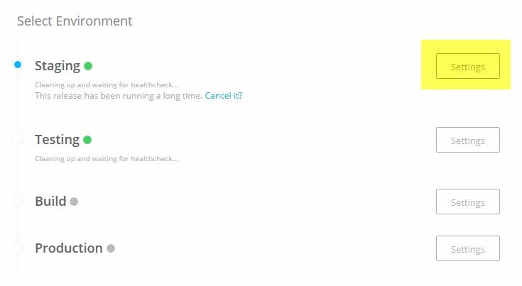
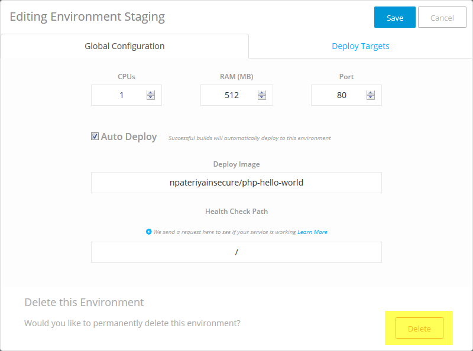

# Shipped - Delete an Environment 

Deleting an environment removes the environment and  the deployed container for services in the project. For example, deleting the "Production" environment deletes the namespace AND the running containers for this environment.

Deleting an environment is permanent and can't be undone.

## Delete an Environment using the UI

1. From the Deploy tab, next to the environment you want to delete, click **Settings**.

	

	The **Editing Environment** window opens.

2. At the bottom of the window, click **Delete**.

	

	The confirmation window opens.

3. Type the name of the environment, then click **Delete Environment**.

	To back out of this procedure, click **Cancel**.

The environment is removed from your project.

## Delete an Environment using the API
This feature has not been implemented.

## Delete an Environment  using the CLI

Remember, this action is permanent and can't be undone.

Within the Shipped Console:

To delete an environment, specify the project and environment IDs, then use *delete*.

	environment delete <projectID> <environmentId>

*-or-*

	enviroment delete 183d5961-71f5-11e5-b058-0242ac110238 %staging

A **Delete Confirmation** message comes up. Type **Y** to continue

<h2> Next Lesson </h2>

 <a href="../shipped-deploy-project/step/1"> Deploying a Project</a> 

