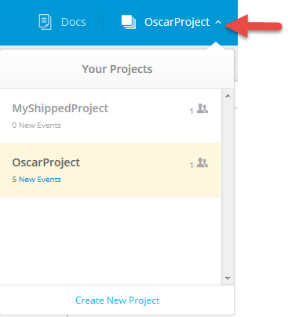

# Get Projects

You can view a list of your projects, or retrieve a specific project.

##Get a Project List using the UI

Within the Shipped UI, select the Project list down arrow to see a list of projects

Select a project from the list to go to that project.

##Get a Project List using the API

To see all projects, use *projects*.

For example:

	curl https://api.ciscoshipped.io/projects
	
HTTP request: 

	GET https://api.ciscoshipped.io/projects

To retrieve a specific project, use the project ID or name.

For example:

	curl https://api.ciscoshipped.io/projects/b475996d-dd1e-11e4-9917-0090f5d8986c

HTTP request:

	GET https://api.ciscoshipped.io/projects/<projectID>

##Get a Project List  using the CLI

Within the Shipped Console:

To see all projects, use *getall*.

	project getall

To retrieve a specific project, use *get* and the project ID or name.

	project get 183d5961-71f5-11e5-b058-0242ac110238

*-or-* 

	pr get 183

*-or-* 

	pr get %myproject

