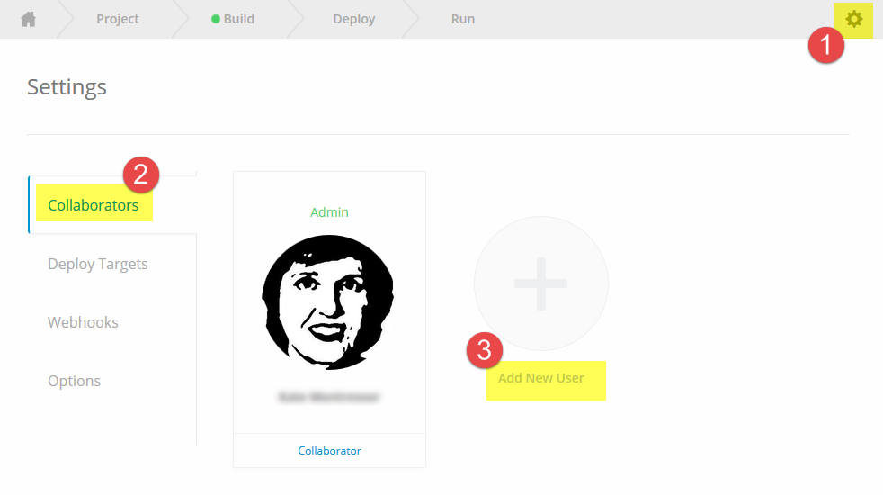
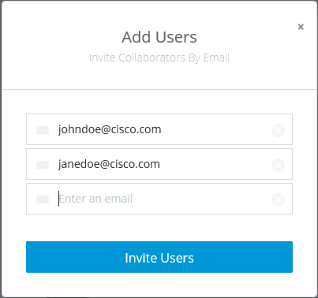

# Shipped - Managing Users
A User is anyone with access to the deployed project. When you create a project, you are automatically designated a User, although you are the only one. You can add as many users as you want.

Add users by sending an Invite Token, which they receive by email. When they respond, Shipped  automatically adds them as users.

## Objectives

Completion time: 15 minutes

You will learn how to:

- <a href="#create">Create a User</a>
- <a href="2.md">Delete a User</a>
- <a href="3.md">Get the Users</a>

## Prerequisites

- You must have built and deployed a project.
- See *Bootstrap a Project*.

## References
You can open these references in a separate tab and refer to them during this Lab.

- <a href="#" target="_blank">Shipped Getting Started Guide</a>  
- <a href="https://cisco.jiveon.com/docs/DOC-811787" target="_blank">High-level view of Shipped</a>  
- <a href="#" target="_blank">Shipped User Guide</a>  
- <a href="#" target="_blank">Shipped API Reference</a>  
- <a href="#" target="_blank">Shipped CLI Reference</a>  

## Add a User using the UI

1. Click **Settings**, then select the **Collaborators** tab.

	
	

2. Click **Add New User**.

	The Add Users window opens.

	
	

4. Enter user email addresses. You can enter as many email addresses as you need.
5. Click **Invite Users**.

Emails are sent to each user with unique token numbers. When they respond, they are then able to log into the project.

## Add a User using the API

You can create an invite token for single or multiple email addresses. This endpoint sends the invites to these addresses.

	curl 'https://api.ciscoshipped.io/invite_tokens' -H 'Content-Type: application/json' -d '{"project_id":"34a35726-66e9-11e5-99df-0242ac110120","emails":["mikejihbe@gmail.com"]}'

HTTP Request:

	POST https://api.ciscoshipped.io/invite_tokens

Shipped accepts an invite by resolving an invite token. If authenticated, Shipped adds the current user to the project; otherwise,  instructs the client to redirect to the authentication view.

	curl 'https://api.ciscoshipped.io/invite_tokens/c490939f-66ff-11e5-9de2-0242ac110121'

HTTP Request:

	GET https://api.ciscoshipped.io/invite_tokens/<INVITE_TOKEN>

## Add a User using the CLI

This feature has not been implemented.
