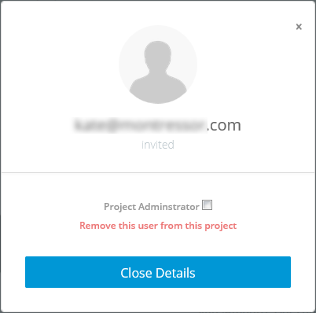

## Shipped - Deleting a User

You can permanently delete a user at any time. Users can't be modified, but they can be deleted and added again.

## Delete a User using the UI

1. Click **Settings**, then select the **Collaborators** tab.

	The users list is shown.

2. Select a user. The user details box comes up.

	
	

3. Click **Remove this user from the project**.

	The delete user confirmation message shows up.

4. Click **Remove User**.

	The user no longer has access to the project.

## Delete a User using the API
Deleting a user permanently removes them from the project. Any components they have created remain.

To delete a user, specify the user ID, then use *DELETE*.

-	If no user ID is specified, the current user is used.
-	If no project ID is specified, the current project is used.

For example,

	curl -X DELETE 'https://api.ciscoshipped.io/users/52534/from_project/b646e23d-4687-11e5-a93e-0242ac1100ac'

HTTP request:
	
	DELETE https://api.ciscoshipped.io/users/<USER_ID>/from_project/<projectID>

## Delete a User using the CLI

Deleting a user permanently removes them from the project. Any components they have created remain.

Within the Shipped Console:

To delete a user, specify the user ID and project ID, then use *remove*. 

-	If no user ID is specified, the current user is used.
-	If no project ID is specified, the current project is used.

For example,
	
	users remove b646e23d-4687-11e5-a93e-0242ac1100ac
*-or-*

	1550678 remove 

