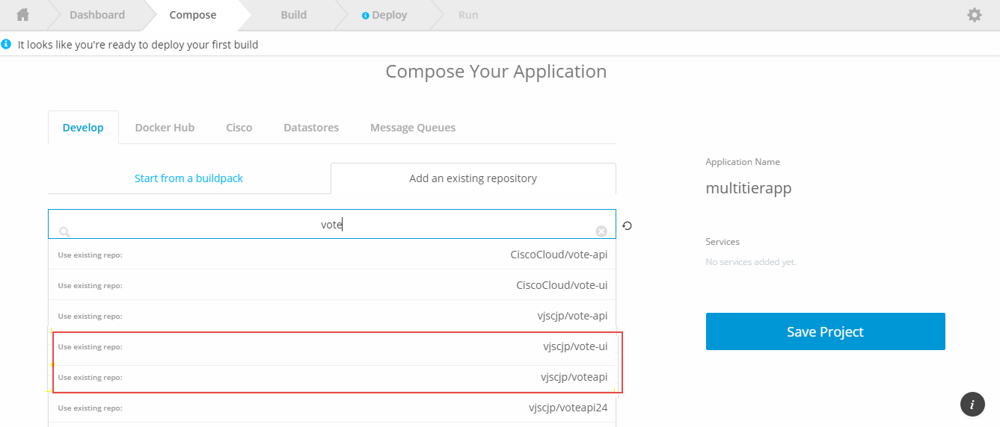

## Fork Sample Application from CiscoCloud.

### Fork vote-api & vote-ui from below link 

1) <a href="https://github.com/CiscoCloud/vote-api" target="_blank">vote-api</a>
2) <a href="https://github.com/CiscoCloud/vote-ui" target="_blank">vote-ui</a>

Note : <a href="https://help.github.com/articles/fork-a-repo/#fork-an-example-repository" target="_blank">How to Fork Git Hub?</a>, Ignore if you already did.

After Fork done, Repo will be copied from CiscoCloud to your own public repo.

## Create project & Add Services in Shipped.

Project Name : "multitierapp"

Under <b>Develop</b> Tab > Go to <b>Add Existing Repository</b> Section > Search for vote-api and vote-ui

App highlighted repo to your project.

Project will look like this 

### Adding Datapack Service to Project 

Go to <b>DataStore</b> > Add <b>Postgres</b> datapack service

 

## Build Project 

Click on Save project that trigger build for all the services we have added.

Once build Get Complete we will Deploy.

<table><tbody><tr>
<td align="right"><a href="3.md">Next</a></td>
</tr></tbody></table>

