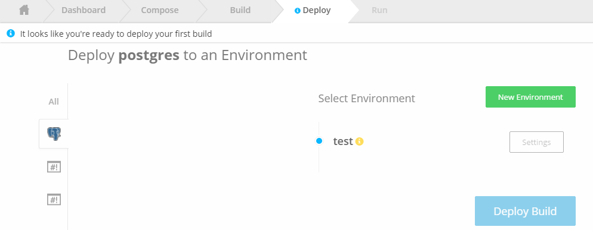

## Create Environment

Click on <b>New Environment</b>, Enter Name of Env "Test" and Save it.
Our <b>test</b> environment has been created.

## Deploy Services 

### Deploy Data Service (Postgres)

Select Postgres from left hand side and, choose the env, we have "test". then click deploy. Your app started running.

<b>IMP</b> : We have to get the env variables from "Postgres"

Click on Env Settings for Postgres.

Scroll Down

Keep the env variables with you, because these variable we will set it to vote-api.
to connect vote-api to database.

Now Go Up and click "back to environment".

### Deploy vote-api 

<b>IMP</b> : We need to set the env variable to the same env and then click on deploy button, "Don't click on deploy before setting env variable."

Again go to setting, Add new Env variables as below .

Add new env variables as given below and then save.
Note : Don't change the key value.

You will be back to environment.

Now lets deploy vote-api. 

Vote-api is deploying 

vote-api gets deployed 

<b>IMP</b> this will trigger and create env variable for vote-api. and 
Env variable will be HOST_VOTE_API as we need rest api end point for application so our ui application will read same env variable.

### Deploy vote-ui

*Don't deploy until your API get deployed.

We have verified that ENV variable <b>HOST_VOTE_API</b>, under setting section get created, screen given below.

Get back to env and deploy vote-ui.

Click on deploy button to deploy vote-ui.

vote-ui also get deployed 

