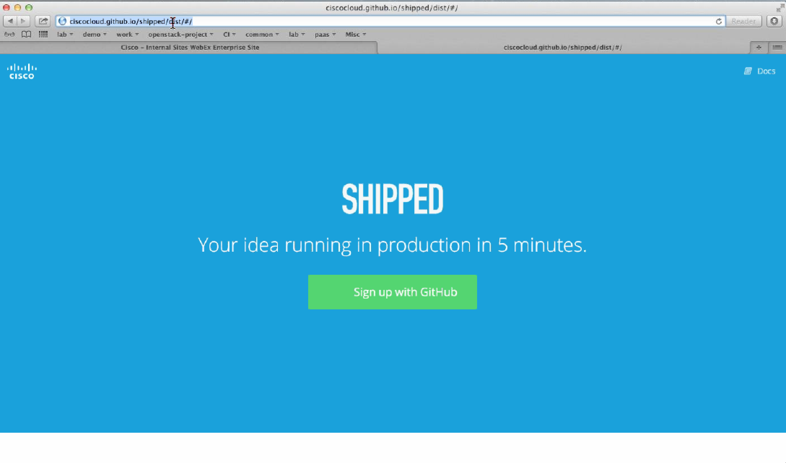
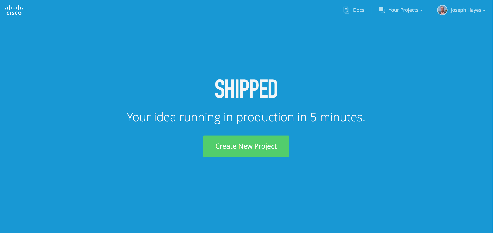
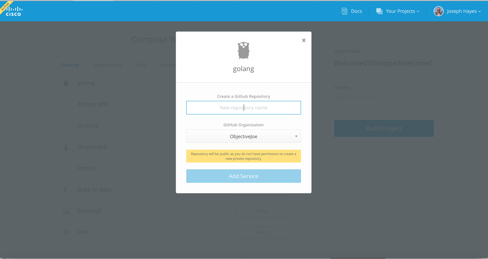

## Sign into Shipped / Create an account on GitHub

1. In the browser navigate to <a href="https://github.com/" target="_blank">GitHub</a>.

	 If you have not yet created a User ID, click **Register** and follow the instructions.
    
2. In the browser navigate to <a href="https://ciscoshipped.io/" target="_blank">Shipped</a>.

	 Once you have registered with GitHub,  use your user ID to log in to Shipped. 
    
	

    
##  Create your first project with Shipped    

1. Click  **Create New Project**.

	

2. Enter the name of your new project name, then click **Start Composing**. For this example, we are using "MyFirstShippedProject".
 
	The **Compose Your Project** page appears.

	You are presented with various pre-defined development frameworks, which enable you to quickly build a generic project. These include:

	* Ruby on Rails
	* GruntJS
	* Python
	* Golang
	* Dropwizard
	* ExpressJS
	* ASP.Net MVC
	* PHP

3. Select a development framework. For this example, we chose Golang.

	

4. Choose a Repository.
5. Enter a name for the repository for the Docker image that will be created as a part of this project. For this example, *shipped101helloworld* was chosen.  
6. Click **Add Service**. You can add multiple services here if you want.

	

7. Click **Next Step**.

	You might be prompted to add dependencies such as Cisco APIs, Datastores, or Message Queues. Dependencies are not needed now. 

1. Click  **Build Project**. 

	The build status shows on the page. This might take a minute to complete. 

	When finished, your Shipped project has been created.

**Next**, learn how to <a href="../shipped-bootstrap-project/1.md">bootstrap your project and work with your repository.
