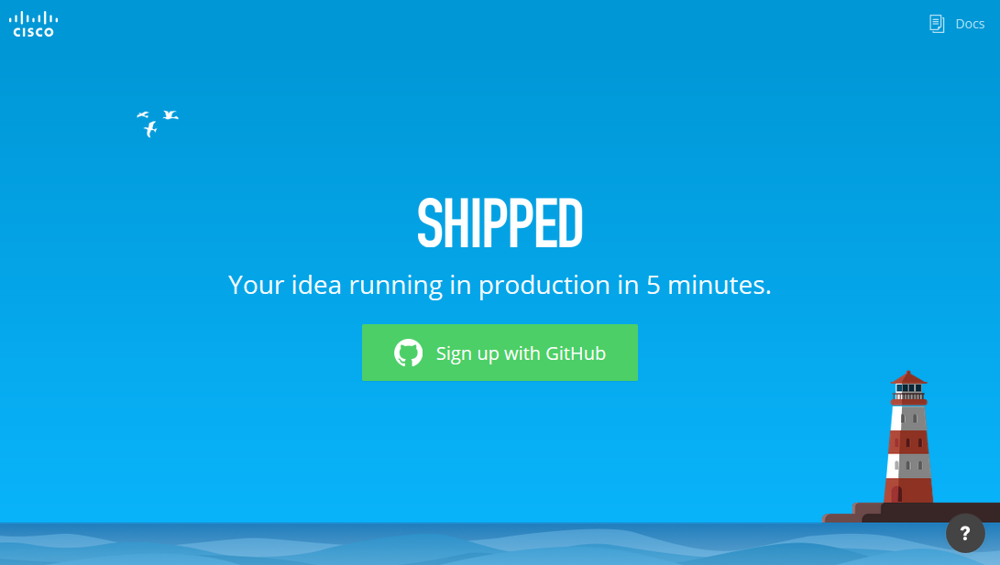
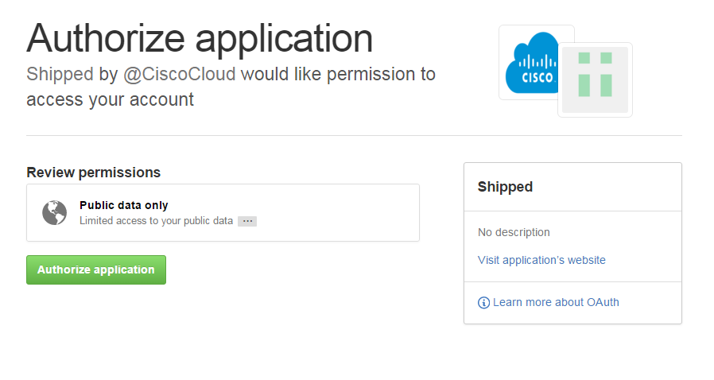
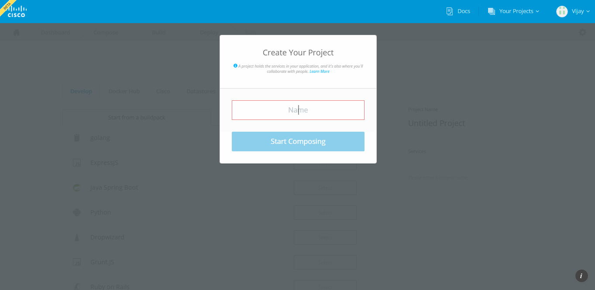

#Shipped 2 - Quick Start

This lab will get you quickly up and running on Shipped.

## Sign into Shipped / Create an account on GitHub

Pre-requirement is one Github Account, If you already have github account, then you are ready to Build and Deploy your first project on Shipped.
or Else You have to created a User Account in Github.

To create new github account navigate to <a href="https://github.com/join" target="_blank">GitHub</a>, and register Your self. 
     
You can use Shipped with any modern browser, but for optimal results, Chrome is recommended.

1. In the browser navigate to <a href="https://ciscoshipped.io/" target="_blank">Shipped</a>.

	 The Signup page open. 

	
    
2. Click **Sign Up with Github**. Shipped checks Github for your credentials.

    Unless you're currently logged into GitHub, the GitHub sign in page opens. This requires only for the first time user.
    
    
    
3. You will be redirected to Create Project Page.

    

Note: If you've already created a Shipped project, Shipped will show information about that project instead of above form. You can continue working with that project, or create a new project.

You are ready to go for Compose new project in Shipped.