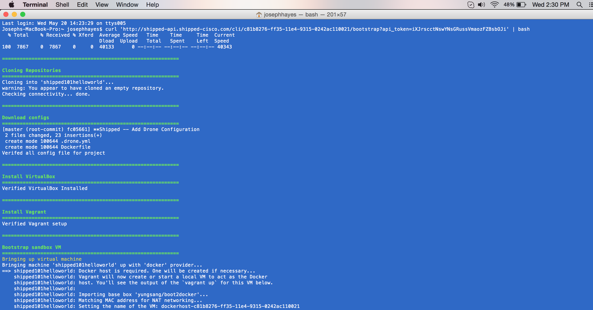

#  Bootstrapping and Docker

1. Open a terminal window (Mac) or Command Prompt (Windows) on your local computer.

	**Mac Users**: Press **Command + Space** to open Spotlight Search. Type *Terminal*, then double-click the Terminal application to open. From the menu, go to **Shell > New Window**.

2. Bootstrap your environment. A bootstrap is a script that brings down the required software for your development environment.

	When the project was successfully built, a curl command was shown. For example:

<pre>'"curl 'http://shipped-api.shipped-cisco.com/cli/b56b264b-fa6d-11e4-953e-0242ac11000a/bootstrap?api_token=qIexsFzXzrlcztxcdJJFuyZHRCovgpVv' | bash"</pre>

3. Copy and paste this command into the terminal window or command prompt, then press **Enter**.

	This command executes the following actions:

	- 	Cloning Repositories
	- 	Download configs
	- 	Install VirtualBox
	- 	Install Vagrant
	- 	Bootstrap sandbox VM
	
	For example, the output could look like this:

	
	

4. Go to [GitHub](http://github) to see your repositories appearing, matching the name you chose in Shipped. It does not yet contain any files.

	You can return here at any time to ensure your files are loaded into the repository.

5. From the terminal window, type *ls* then press **Return**.

	From the Command prompt, type *dir*, then press **Return**.

Your Shipped project directory is shown.

6. Change to that directory, then get this list of files again. A directory matching the  Shipped repository is shown.

		$ cd MyFirstShippedProject
		$ ls
		Makefile		shipped101helloworld

7. Change to the repository directory, and get the list of files.

	Confirm that one of the files is named *Dockerfile*.

		$ cd shipped101helloworld
		$ ls
		Dockerfile

8. Change to the Docker directory, then issue the command:

		$ cat main.go

The Shipped Golang buildpack has a hello-world application ready to go. The bootstrap script  starts the application locally and tells you it started on localhost:####. You can curl localhost:#### and have it return a *hello world* response.

The following response appears. Note that the application is listening on port 8888.

<pre>
package main

import (
	"fmt"
	"net/http"
)

func defaultHandler(w http.ResponseWriter, r *http.Request) {
    fmt.Fprintf(w, "<h1>Hello from Cisco Shipped!</h1>\n")
}

func main() {
    http.HandleFunc("/", defaultHandler)
    fmt.Println("Example app listening at http://localhost:8888")
    http.ListenAndServe(":8888", nil)
}
</pre>

Next, learn how to interact with Vagrant.

