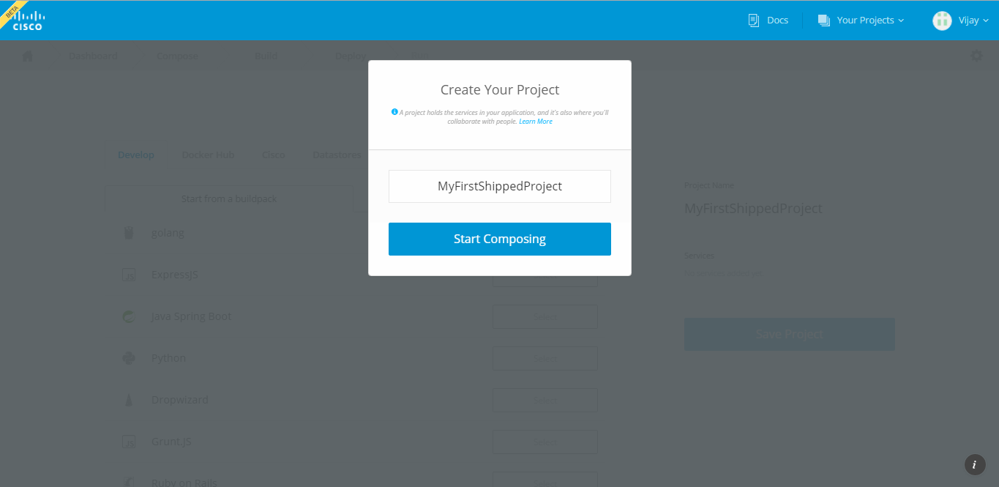
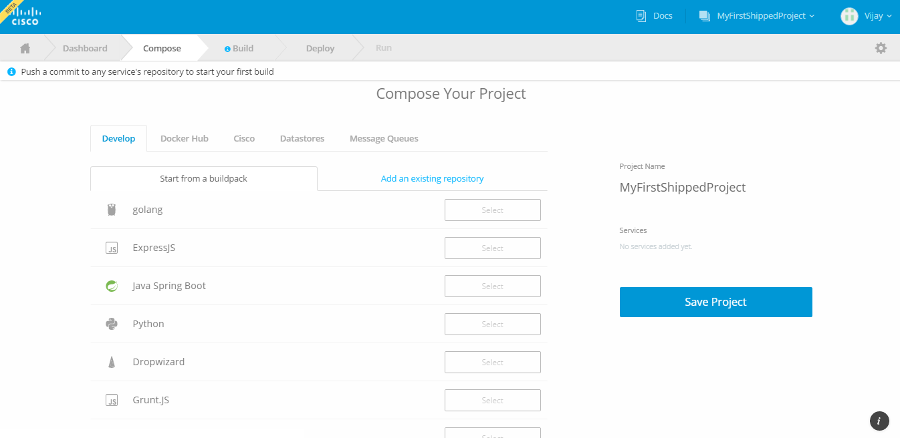
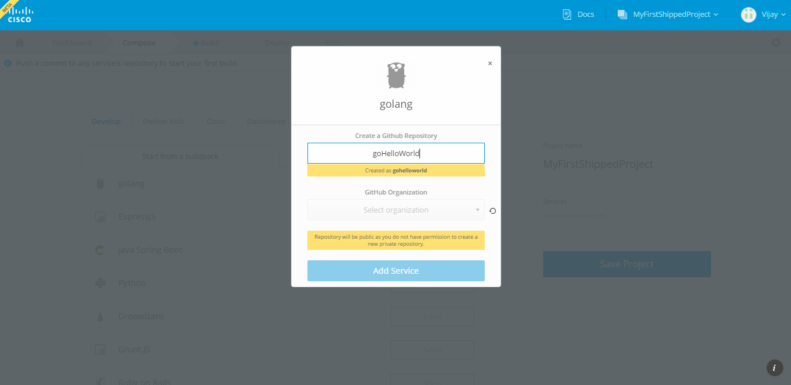
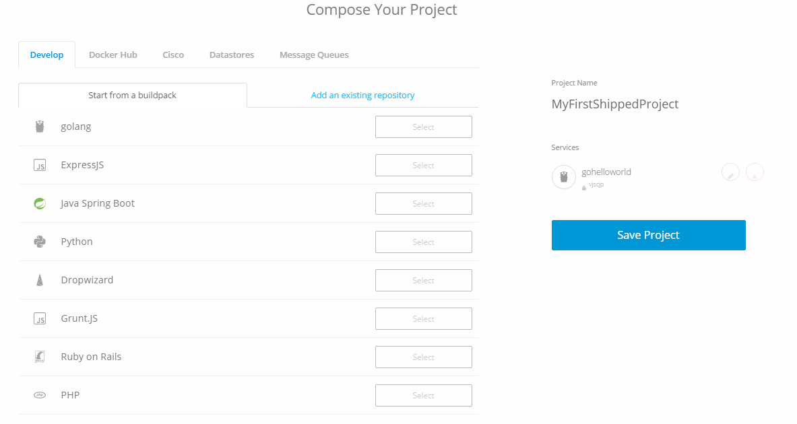

##  Create your first project with Shipped    

1. Enter the name of your new project name, then click **Start Composing**. For this example, we are using "MyFirstShippedProject".

	

2. The **Compose Your Project** page appears.
 
	

3. Determine the service you want to include in your project.
    
    

<table border="1">
    <tbody>
        <tr>
            <td>Develop</td>
            <td> It has various pre-defined development frameworks, which enable you to quickly build a generic project or you can choose any existing project from your Github account.</td>
        </tr>
        
        <tr>
            <td>Docker Hub</td><td>Search any Docker Hub images here.</td>
        </tr>
        
        <tr>
            <td>Cisco</td><td>It has pre developed web apps using Cisco other project rest api, Such as Tropo, CMX, APIC-EM..</td>
        </tr>
        
        <tr>
            <td>Data stores</td><td>It Included Database Such as Mysql, Cassandra, MongoDB etc.</td>
        </tr>
        
        <tr>
            <td>Message Queue</td><td>It included Queuing Services such as kafka, RabbitMQ etc.</td>
        </tr>
    </tbody>
</table>

4. For this example, Let select Golang development framework, Enter Service name as "goHelloWorld".

	
  
5. Select Github Organization, By Default Choose Your default, then Click **Add Service**. 

    Note : You can add multiple services here if you want.

	

6. Click  **Save Project**. 

	Shipped builds the project and sets up the GitHub repositories. While building, the progress bar is shown. 

	When finished, your Shipped project has been created.

