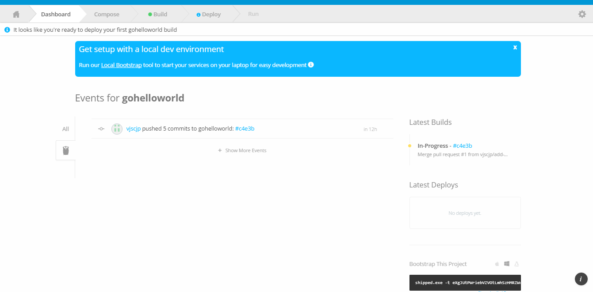
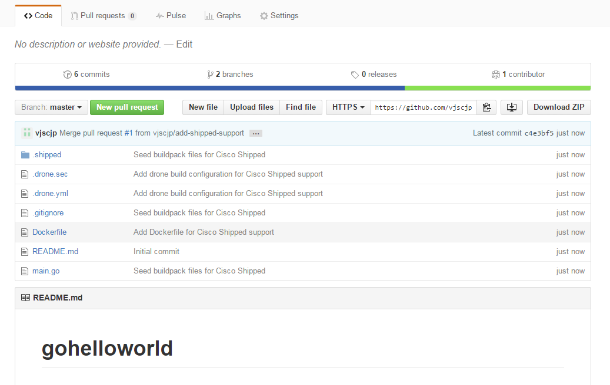
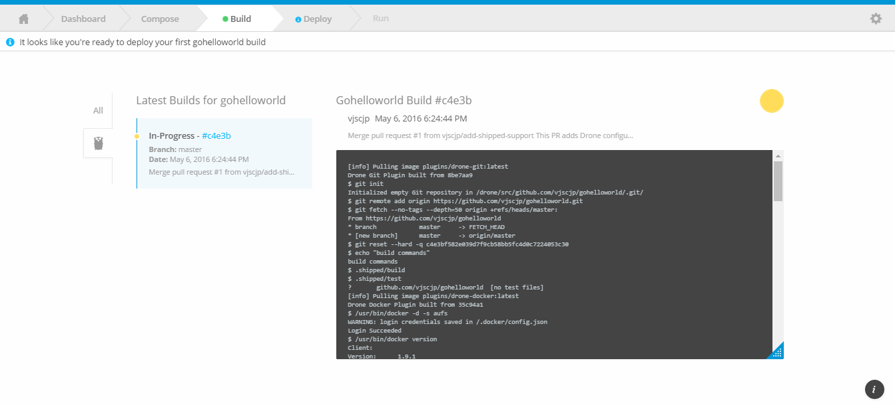
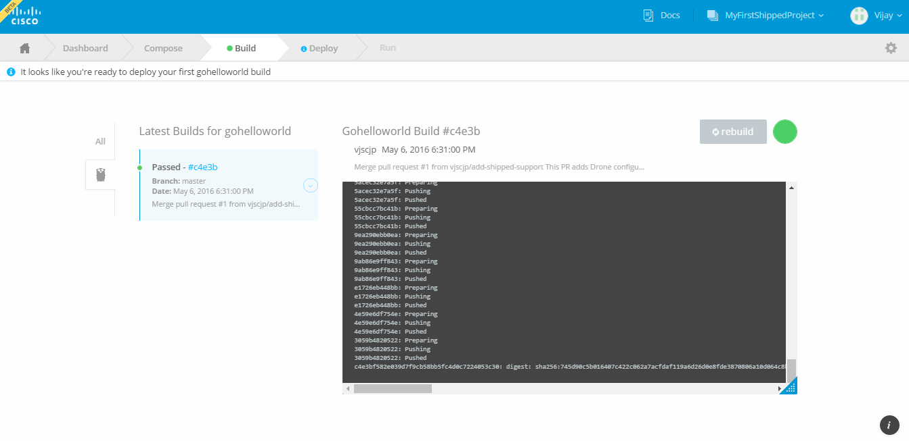

# Building your first project

1. Once you click on **Save Project**, you will be redirected to dashboard tab.

    

    and at backend Shipped will create Github repository and also add few project related files to it. Now go to your Github account and Search for "goHelloWorld" repo and view project folder. With this, Shipped adds a private repo to Drone to build your project.

	
    
    Note : These files are responsible for Build and Run your project. You can have a look at these files Added by Shipped : Docker File, Drone.sec, Drone.yml and .shipped (folder).

2. Now **Click to Build Tab** and see the progress of your first build.
    
    You can see the build logs at right hand side, On Left hand side status of project build, Currently its in "In Progress" status.

    

3. After Sometime, Your build status will get changed to either "Passed" or "Failed" status. 

    In case of failed status you need to verify if your project code is buildable or not, you can see more details on right hand side build logs. As of now in our case Build gets "Passed"
    
    

Now your first build is ready to deploy.