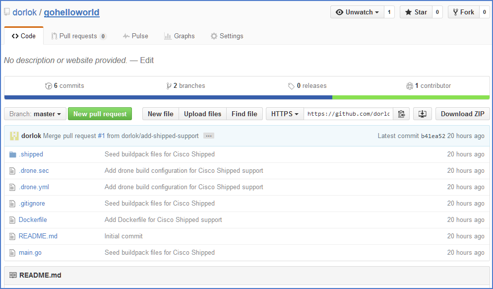

# Building your First Project

You are now redirected to the dashboard tab, showing the events of your project. At the backend, Shipped creates a Github repository and adds a few project related files to it. 

1. Go to your Github account and search for **goHelloWorld** repo.

2. View the project folder; Shipped adds a private repo to Drone to build your project.  
    **Note**: Shipped adds the **.shipped** folder and the following files that are responsible for building and running your project: **Drone.sec**, **Drone.yml**, and **Dockerfile**.  

	

3. Click the **Build** tab and observe the progress of your first build.  
    The build logs appear on the right and the status of project build on the left. The project is in the **In-Progress** state as indicated by the yellow circle.

    

    When your build status changes to the **Passed** status, your first build is ready to deploy. 

    

    **Note**: If the build status is "Failed," see the details on the right and verify that your project code is buildable. 

