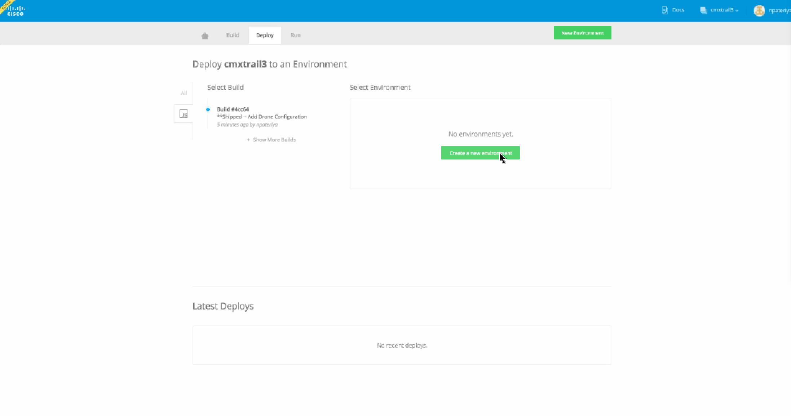
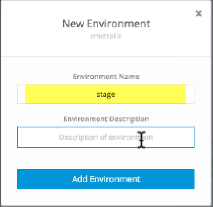

# Using Environments

Environments are virtual places to deploy your project. You can have as many environments as you want, and they can be the same as each other, or not.

For example, you might want a *Development* environment for developers to continue working on your application. The *Staging* environment is a good place for testing, while the *Production* environment could be a verified stable build.

You can name your environments any way you want.

1. From the Deploy tab, click **Create Environment**.

	
	

2. Enter a name and description (optional), then click **Add Environment**.

Initially you will have no environments created. Clicking "Create New Environment" will create one for you. All you do is have to enter the name and description for your environment and click "Add Environment".

	
	

3. Make sure the environment is selected, then click **Deploy Build**. 

	Deploying a build to an environment means that your project will be deployed to the environment you select. It replaces any previous deployment of the build to that environment. 

4. When the project is deployed, Shipped shows a URL to the build. Copy and paste the URL to your browser to access the build.

## Summary

You have bootstrapped a local development environment from the URL given by Shipped, added source code, validated it locally in Vagrant, and pushed your changes to GitHub and Shipped. You have created an Environment and deployed a build.

