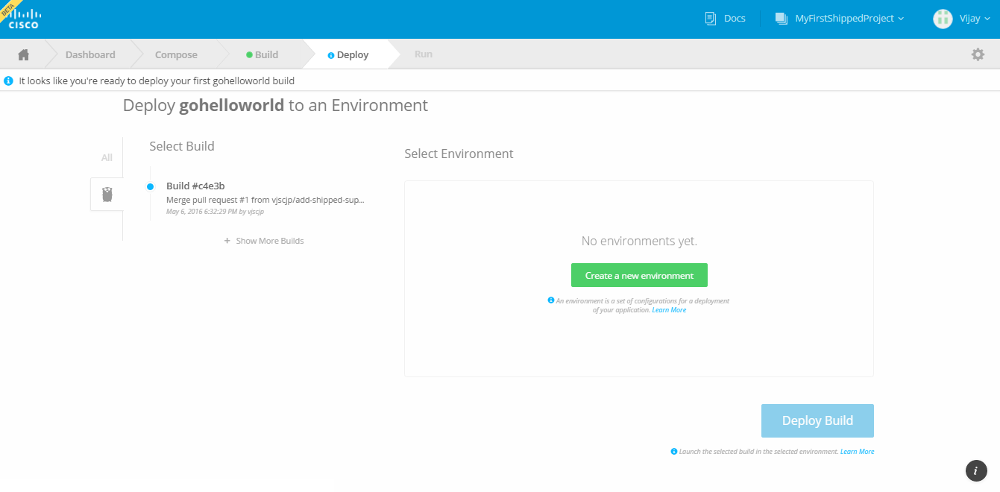
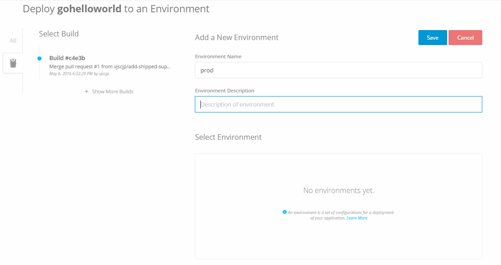
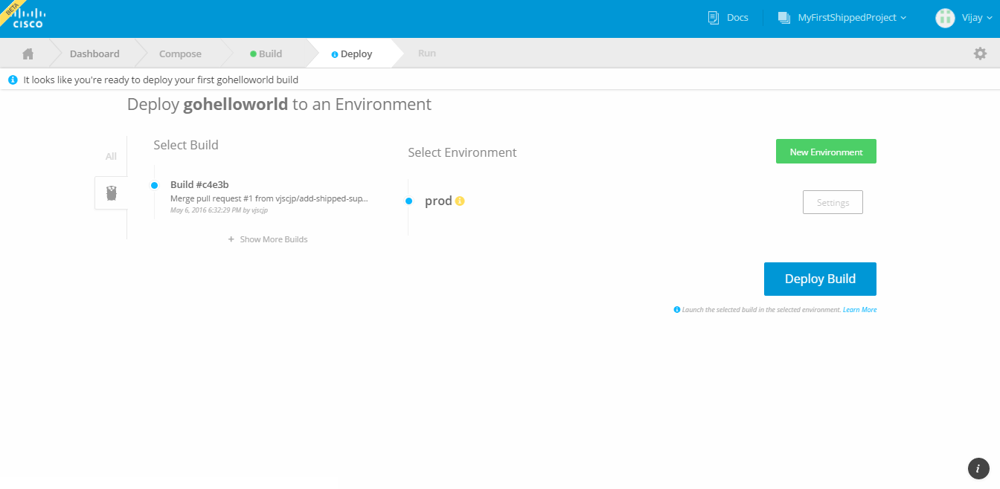
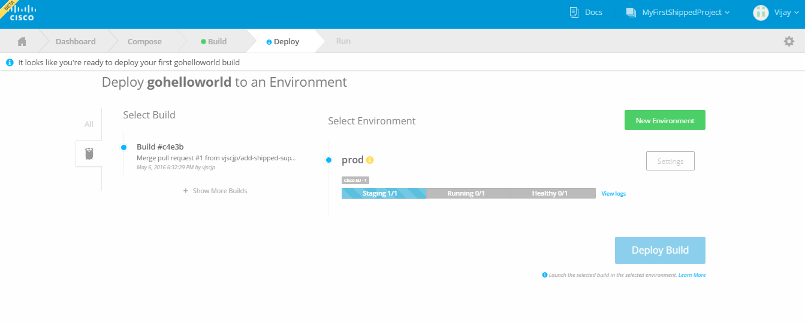
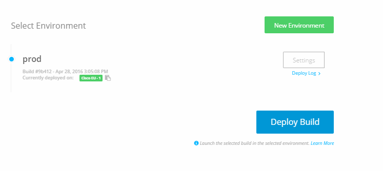

# Using Environments

Environments are virtual places to deploy your project. You can have as many environments as you want, and they can be the same as each other, or not.

For example, you might want a *Development* environment for developers to continue working on your application. The *Staging* environment is a good place for testing, while the *Production* environment could be a verified stable build.

You can name your environments any way you want.

1. From the Deploy tab, click **Create a new Environment**.

	

2. Enter a name and description (optional), then click **SAVE**.

    
    

3. Our First Environment is ready, Make sure environment and build is selected. 

    Note: As you do commit new file or update old files in your github project repo, automatically new builds get triggered. So you have to make sure which build you need to deploy.
    
    In our case we have only one build option which is by default selected, So let click **Deploy Build**. 

	Deploying a build to an environment means that your project will be deployed to the environment you select. It replaces any previous deployment of the build to that environment. 
    
    

4. After that you build is deloying on your environment, You can see progress bar below the Environment. 

   

5. When the project is completly deployed, Shipped shows a URL in green color link "CISCO EU" for the build, and progress bar disapper.

   
   
   Wow, You have successfully build and deploy your first project.
   
## Summary

You have bootstrapped a generic shipped project, You have created an Environment and deployed a build successfully.

