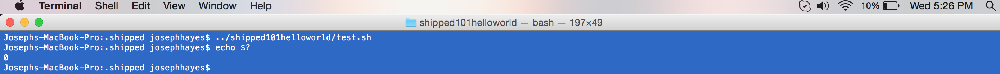

# Interact with Vagrant #

1. Confirm you are in the Docker directory.

		$ ls
		Dockerfile	main.go	

2. Go up one level to the parent directory.

		$ cd ..

3. Change into the hidden subdirectory *.shipped*, then get the list of files. Confirm the Vagrantfile is in this directory.

		$ cd .shipped
		$ ld
		Vagrantfile

4. View the contenst of Vagrantfile and notice the port mapping.

		$ cat Vagrantfile

Port 8888 is what your golang file is listening on. Port 38888 is the local port being mapped to port 8888 when your application is running in Docker:
        d.ports = ["38888:8888"]
        d.name = "shipped101helloworld"
  	  
5. After adding source code to your project, reload Vagrant.

		$ vagrant reload

6. Verify your application is running, open a browser to

		http://localhost:38888. 

	You should see "Hello from Cisco Shipped!"

7. To stop the virtual machine, issue the command:

		$ vagrant halt

	

	Here are some other useful Vagrant commands:

Here are a list of other useful vagrant commands. 

	- **vagrant global-status** - see what containers are running, and their ids.
	- **vagrant destroy <container_id>** - destroy a container that is running
	- **vagrant global-status-prune** - destroy containers that are stopped.
	- **vagrant docker-logs <container_id>** - see the logs of a docker container
	- **vagrant docker-run <container_id> pwd**  - run commands in the container

8. Saving your changes into GitHub causes them to be published to Shipped.

	Change to the source directory.

		$ cd ../shipped101helloworld

9. Add your changes to the git change list.

		$ git add -A

10. Commit the changes to the local storage.

		$ git commit -m "first shipped commit"

11. Push the changes to the GitHub repository and notify Shipped.

		$ git push origin master

	

**Next**, learn about using Environments

