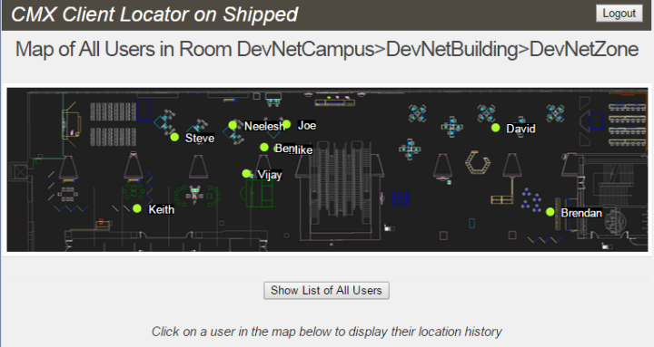
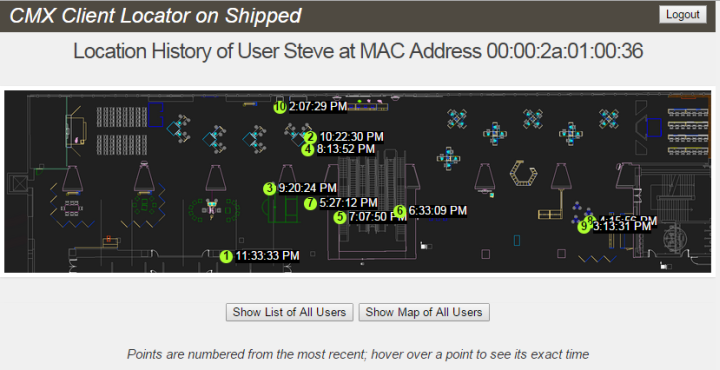
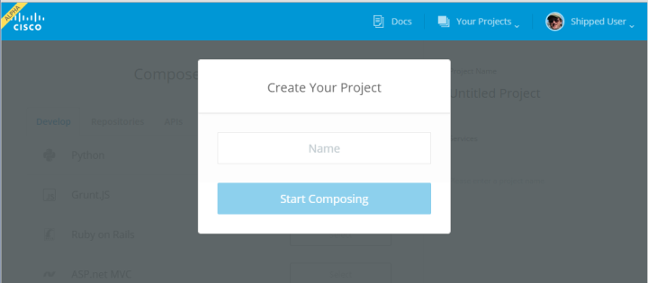

# Shipped 102: Creating a CMX Project #

In this Learning Lab you create and a project using the Cisco [Connected Mobility Experiences (CMX) API](https://developer.cisco.com/site/cmx-mobility-services/).

**Platform** 
Shipped supports Mac OS X, Windows 7 or higher, and Ubuntu 13.04 or higher.  This lab was prepared and verified on Windows 7.

## Objective ##

Completion Time: 10 minutes

* Review underlying technologies
* Create, test, and deploy a Shipped project that uses the CMX API to display an interactive map
* Summarize what we have learned, and talk about what's next

## The Shipped CMX Demo Application ##
### Overview: What is CMX? ###
[Connected Mobility Experiences](http://www.cisco.com/c/en/us/solutions/enterprise-networks/connected-mobile-experiences/index.html?vs_f=Products+Launch+RSS+Feeds&vs_p=Cisco+Connected+Mobile+Experiences+Boost+Revenues+with+Better+Service&vs_k=1) is a Cisco solution allowing you to tap into your users connected lifestyle and provide relevant mobile content while gaining meaningful analytics.  CMX can be used indoors to track the location of your users within about a meter and record the history of their movements.  With CMX, the context isn’t just the section of a store, convention floor, or area in a hospital; it is exactly where the person is standing at that moment.  This makes the information more valuable to both the venue and its customers, enabling powerful analytics and enhanced experiences.

The [CMX Mobility Services API](https://developer.cisco.com/site/cmx-mobility-services/) allows you to take advantage of the Cisco CMX solution to enhance and personalize your own applications.  And Shipped makes it easy to get started with the CMX API.

### The CMX Demo Application ###
The application you'll be creating and deploying with Shipped uses CMX to show users at a convention.  The app displays a map of users at the convention:

Clicking on a user on the map shows the location history of that user:

Checking a box on the login form allows you to run the application against either a real CMX server or a virtualized one.  The virtualized server fills API requests from local files, allowing you to run and test the application without installing CMX.

The application consists of a NodeJS server and a jQuery UI.  The NodeJS server both interfaces with the CMX server (real or virtual) and serves the UI.

But you don't have to install NodeJS, jQuery, or anything else to set up and deploy this application.  In less than five minutes, Shipped can set up the application on your local machine, create a GitHub repository for you with its source code, set up a continuous integration build, and deploy your own personal copy of the application to the cloud, so it can be accessed from anywhere on the web.  That's the power of Shipped - your idea, in production, in five minutes.

Let's get started!

## Shipped and its Prerequisites ##
 
### Introducing Shipped ###

Shipped is a Cisco Development Portal that provides an integrated development environment for creating, building, testing, and deploying into the Cisco Cloud in a continuous integration environment. It allows you to quickly create projects from pre-defined development frameworks including:

* Golang
* Python
* PHP
* ExpressJS
* GruntJS
* Ruby On Rails
* CMX

In this tutorial, we'll be creating a project using the CMX API.

### Open Source Software Used by Shipped ###

Shipped uses the following underlying technologies to support your development environment:

* [Git](https://git-scm.com/) is a source and version control system hosted on the web, and [GitHub](https://github.com/) is a repository of Git projects.  Shipped stores your projects on GitHub, and you'll need a GitHub account to use Shipped.

* [Vagrant](https://docs.vagrantup.com/v2/) is an open source tool for managing  development environment and the virtual machines that comprise it.  Shipped uses Vagrant to manage the VMs where it builds and runs your applications.  You'll need Vagrant on your local machine to access the Shipped environment.  If you haven't already installed it, Shipped will download and install it for you automatically when you create your first project.

* [VirtualBox](https://www.virtualbox.org/) is an open source tool for running virtual machines.  Shipped uses VirtualBox to stand up the VMs that run Shipped applications.  If you haven't already installed it, Shipped will download and install it for you automatically when you create your first project.

* [Docker](https://docs.docker.com/) is a platform for developers to develop, ship, and run applications.  When you create a project, Shipped automatically installs Docker on a VirtualBox VM and uses it to run your application on a second VirtualBox VM.  It uses Vagrant to manage and control the VMs - all transparent to you.

## Setting Up ##
 
### Step 1. Set Up GitHub

Shipped stores your projects on GitHub, and you'll need a GitHub account to use Shipped.  If you already have a GitHub account, skip to step 2.  Otherwise, navigate to the [GitHub home page](https://github.com/) using any modern browser (we recommend Chrome), click on [Sign up](https://github.com/join) and follow the instructions to create a free account. You don't need to do anything more with GitHub at this time; Shipped will do it all for you.

### Step 2. Login to Shipped
    
Your GitHub account is all you need to login to Shipped.  Navigate to the [Shipped welcome page](http://ciscocloud.github.io/shipped/dist/#) and click on the big green "Sign up with GitHub" button.   

Shipped displays its home page.  If this is your first time in Shipped, it automatically pops up the Create Your Project dialog.  If not, select Create New Project from the Your Projects dropdown to get the popup:

and you're ready to get started creating a CMX project!
    
  
    