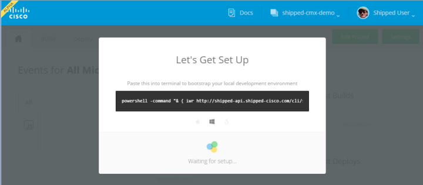
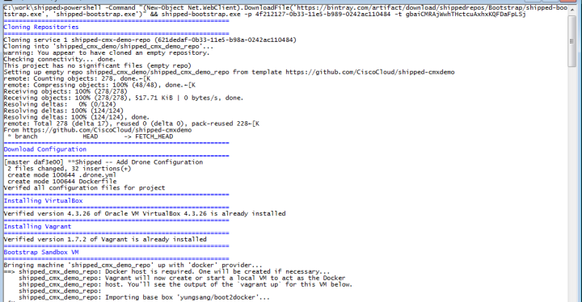
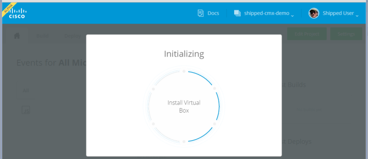
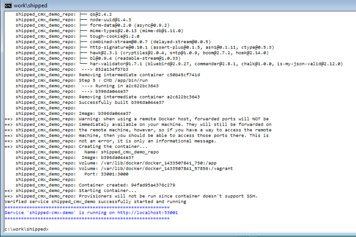
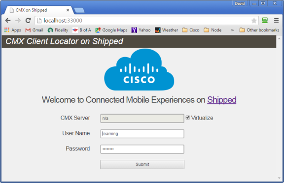

# Bootstrap Your Local Development Environment

Bootstrapping a Shipped project means downloading the project's source code to your machine; setting up a local Git repository tied to the cloud-based repository created by Shipped; installing the pre-requisite software Vagrant and VirtualBox (if necessary); creating and the virtual machines that host your development environment; setting up a continuous integration build; and brings up a web server running the new application.  The process is fully automatic; you just need to copy and paste the command presented by Shipped when you created the project.

### Step 5 Open a Terminal Window ###

The bootstrap process runs in a command-line terminal window, so the first step in bootstrapping your project is opening a terminal window.  The way you do this depends on your operating system:

Operating System | Opening a Terminal Window
-----------------| -------------------------
OS X (Mac)       | Press Command + Space to open Spotlight Search. Type Terminal and double-click the Terminal Application. Menu option Shell -> New Window will open a new window for you.
Ubuntu | Press Ctrl+Alt+T
Windows | Click Start, type "cmd", and press Enter for a normal terminal window, or Ctrl+Shift+Enter for an Administrator terminal window.  You will need an Administrator window if the bootstrap process needs to install Vagrant and VirtualBox. If you already have this software installed, you can use a normal terminal window.

### Step 6 Bootstrap Your Environment

When you completed creating your project in Step 4 of this tutorial, Shipped popped up the Let's Get Set Up form containing the bootstrap command:

 . 

Shipped shows the command for your operating system in the black box in the center of the form.  Click on the command to select it, and then copy and paste it to the terminal window you created in the previous step.  The command downloads the bootstrap executable and then runs it.  It does this with curl on OS X and Ubuntu, and with PowerShell on Windows.

The bootstrap executable does everything mentioned at the beginning of this section of the tutorial: it downloads source code, sets up Git, installs prerequisite software, stands up VMs to host the application, sets up an automatic build, and brings up the application server.  All you have to do is watch it run.  You see it running both on the terminal window:  

and on the Shipped browser window, which displays a circular animation ticking off each step in the bootstrap process as it happens:

Among its other actions, the Shipped bootstrap process brings up a web server on a newly-created VM and uses it to run your application.  The last few lines output on the terminal window show you Shipped is running the application:

Navigate to the cited address on your browser to verify the application is running on a VM in your local machine: 

Shipped installed the CMX demo application on your machine (complete with source code) and created a VM to run it!  But Shipped is for developers, and it does a lot more than this.  Let's go on to the next steps in this tutorial, where you'll run your first build and deploy the application to the cloud. 

If you're impatient to explore the CMX demo application itself, go ahead. You can come back to the lab and continue with building and deployment at any time.  See Step 9 of this tutorial for an introduction to the application.  Additional documentation is available in the README.md file in the repository Shipped created for you.

