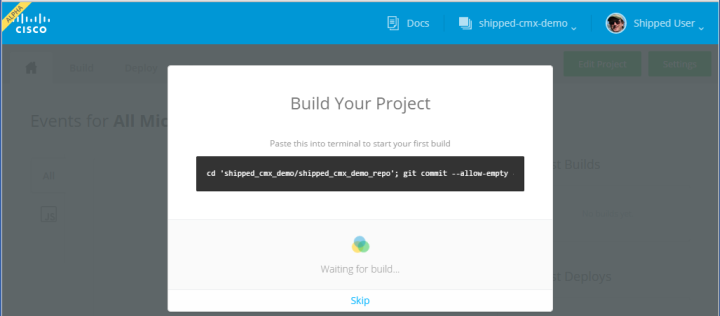
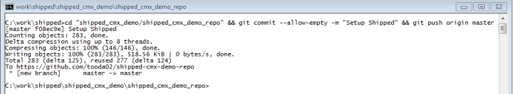
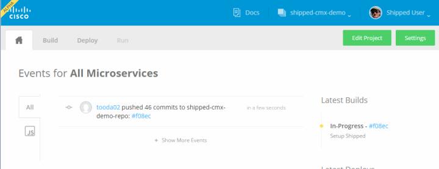
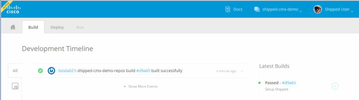
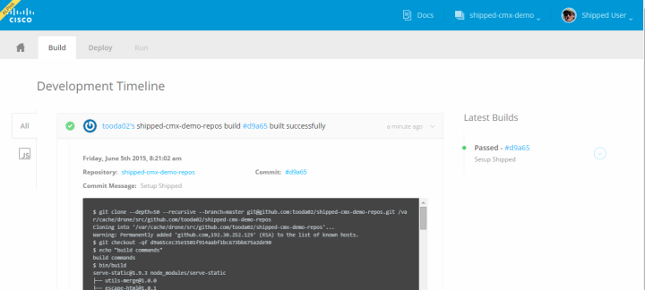
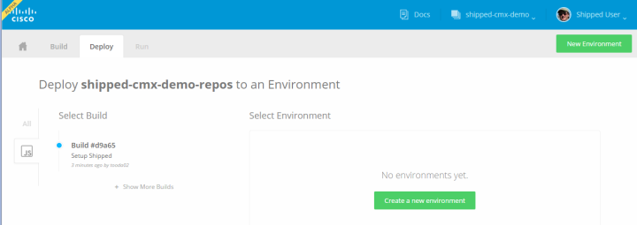
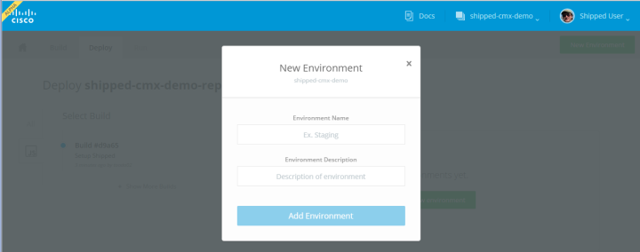
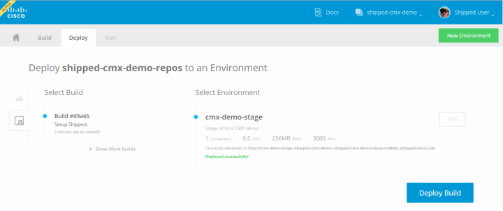

# Build and Deploy the Application

### Step 7 Run a Build

Among the tasks Shipped performed during bootstrap was to store the application's source code in a local Git repository tied to the Git repository in the cloud, and set up a continuous integration build, so that any commit to the repository automatically triggers a build.  When the bootstrap process completes, the Shipped browser window displays the command you need to run your first build:

Once again, select the command by clicking on it, copy and paste it into your terminal window, and press Enter.  The command changes the directory to the one containing your new local Git repository and commits the initial copy of the application source to your cloud-based remote Git repository:

This automatically triggers a build, as you can by looking at your browser window:

Click on the Build tab to review the status of the build.  It takes a couple of minutes for the build to run.  Periodically click refresh on your browser until you see the build complete:

You can see that the build succeeded because the message under Latest Builds is "Passed", and the message under "Development Timeline" is "built successfully".  You can inspect the build log by clicking on the green checkmark to the left of the "built successfully" message:

### Step 8 Deploy Your Project to the Cloud

The last step in the bootstrap process is deploying your project's application to the Cisco cloud.  To do this, click on the Deploy tab at the top left of the screen. Shipped displays the Deploy tab with a message that there are currently no deployed environments:

To create an cloud environment for your application, click on the "Create a new environment" button.  Shipped displays the New Environment dialog:

Fill in a name for your environment (for example, "cmx-demo-stage") and an optional description (for example, "Stage of first CMX demo").  Then press the "Add Environment" button.  Shipped closes the New Environment dialog and redisplays the Deploy tab with a Deploy Build button.  Press it to deploy the build to the cloud.  Shipped shows the message "Deploying to environment..." under the environment name, and a short time later replaces it with a "Deployed successfully" message:

Congratulations!  You've deployed your CMX application to the cloud.  Click on the URL in the "Deployed successfully" message to see the application running in its new environment:

