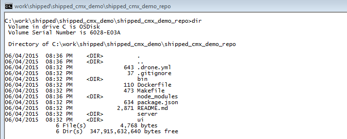

# Supplement: Your Development Environment

This section provides some background information on the source code repository and the open source tools used by Shipped.

### Explore the Source Repository

Your new source repository is in directory *projectName/repoName*. If you used the names suggested in this tutorial, this will be shipped-cmx-demo/shipped-cmx-demo-repo.  The command you ran in Step 7 should have changed the directory in your terminal window to this; if not, change to it manually.

Once you're in the repository directory, you can use the dir command (Windows) or the ls -lu command (Mac and Linux) to list the contents of the repository:

Here's what you see in the directory:

File or Directory | Significance
----------------- | ------------
.drone.yml | A control file for [Drone](https://github.com/drone/drone), the continuous integration build server that Shipped uses
.gitignore | A control file for Git naming local files that should not be committed to the cloud
bin | A directory containing Linux shell scripts for building and running the application. These run in Drone's Linux VM, so they're used even in Windows.
Dockerfile | A control file for Docker specifying how to deploy the CMX application in a Docker container.
node_modules | The directory created by NodeJS containing third-party Node packages used by the CMX demo application
package.json | A configuration file listing the third-party Node packages used by the CMX demo application
README.md | A [markdown file](https://help.github.com/articles/markdown-basics/) documenting the CMX demo application and its REST API. GitHub automatically converts this file to HTML and displays it on the main page of the shipped-cmx-demo-repo repository.
server | A directory containing the Node source for the CMX demo application server
ui | A directory containing the HTML and JavaScript files implementing the CMX demo application web interface

To continue development, update the source code and use Git commands to commit your changes to the repository that Shipped created for you.  A build starts automatically each time you commit changes.  You can repeat steps 7 and 8 as often as you like until the application is tailored to your own requirements.

### Open Source Software Used by Shipped ###

Shipped uses the following underlying technologies to support your development environment:

* [Git](https://git-scm.com/) is a source and version control system hosted on the web, and [GitHub](https://github.com/) is a repository of Git projects.  Shipped stores your projects on GitHub.

* [Vagrant](https://docs.vagrantup.com/v2/) is an open source tool for managing  development environment and the virtual machines that comprise it.  Shipped uses Vagrant on your local machine to manage the VMs where it builds and runs your applications.  If necessary, it will download and install it for you automatically when you create your first project.

* [VirtualBox](https://www.virtualbox.org/) is an open source tool for running virtual machines.  Shipped uses VirtualBox to stand up the VMs that run Shipped applications.  If necessary, it will download and install it for you automatically when you create your first project.

* [Docker](https://docs.docker.com/) is a platform for developers to develop, ship, and run applications.  When you create a project, Shipped automatically installs Docker on a VirtualBox VM and uses it to run your application on a second VirtualBox VM.  It uses Vagrant to manage and control the VMs - all transparent to you.

