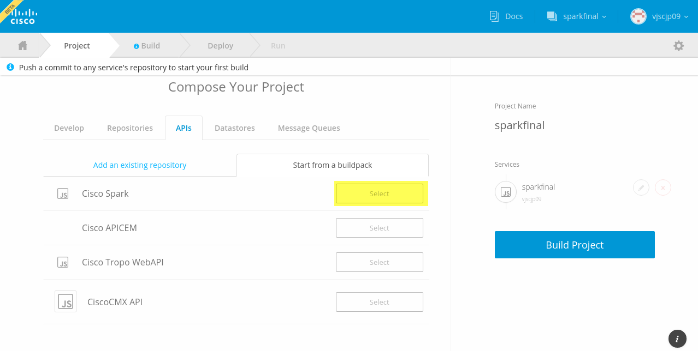

# Shipped - Bootstrap a Project Using Spark

You can bootstrap a Shipped project using Spark.

## Objectives
Completion time: 5 minutes

You will learn how to:

- Bootstrap a project using Spark

## Prerequisites

- *Managing Services*

## References
You can open these references in a separate tab and refer to them during this Lab.

- <a href="#" target="_blank">Shipped Getting Started Guide</a>  
- <a href="https://cisco.jiveon.com/docs/DOC-811787" target="_blank">High-level view of Shipped</a>  
- <a href="#" target="_blank">Shipped User Guide</a>  
- <a href="#" target="_blank">Shipped API Reference</a>  
- <a href="#" target="_blank">Shipped CLI Reference</a>  

## To Bootstrap a project with Spark 

1. Create a project.
2. From the **API** tab, choose the Spark buildpack.

	
 

3. Continue building your application as normal.

