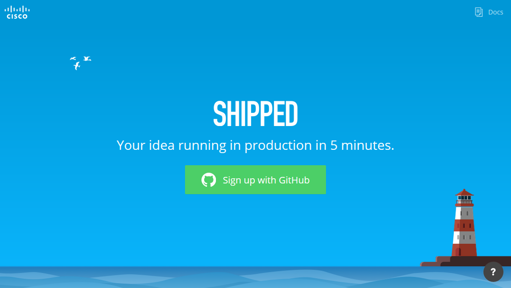
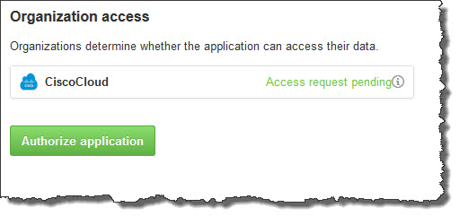

# Shipped - Using Shipped the First Time
Shipped is a DevOps platform that enables you to quickly Build, Deploy, and Run Containerized Microservices.

Shipped is supported on Windows, Mac, and Ubuntu Linux.

##Objectives
Completion time: 5 minutes

- Sync Shipped with a GitHub account.

##Prerequisites

- A <a href="http://github.com" target="_blank">GitHub</a> account.
- If running Windows:
	-  Install <a href="https://github.com/Microsoft/Git-Credential-Manager-for-Windows/releases"  target="_blank">Git Credential Manager for Windows</a>.
	-  Install Remote Server Administration Tool from <a href="http://www.microsoft.com" target="_blank">Microsoft</a> (needed to install Docker).

##References
You can open these references in a separate tab and refer to them during this Lab.

- <a href="#" target="_blank">Shipped Getting Started Guide</a>  
- <a href="https://cisco.jiveon.com/docs/DOC-811787" target="_blank">High-level view of Shipped</a>  
- <a href="#" target="_blank">Shipped User Guide</a>  
- <a href="#" target="_blank">Shipped API Reference</a>  
- <a href="#" target="_blank">Shipped CLI Reference</a>  

##Connect to GitHub

1. In a browser, go to <a href="https://ciscoshipped.io">https://ciscoshipped.io</a> and sign up.
	
	 You can use Shipped with any modern browser, but for optimal results, Chrome is recommended.

	 
	

1. Click **Sign up with GitHub**.

	The GitHub site opens in your browser.

3. Within the GitHub page, click **Authorize application**. You only need to do this the first time you use Shipped.

	
	

	The Shipped UI opens.

You can now run Shipped in three ways:

1. the UI - the easiest method and works on all platforms, although Chrome is recommended.
2. the API - usually for scripting and advanced users.
3. the CLI - within a Terminal window (Linux) or Command Prompt (Windows), navigate to your project directory and type <code>shipped console</code>. Enter the CLI commands from there.

Specific actions for each of these methods is described in the related Learning Labs.

## Next

Go to  [**Shipped - Managing Projects**](http://ciscocloud.github.io/shipped/dist/#) to create a new project.

