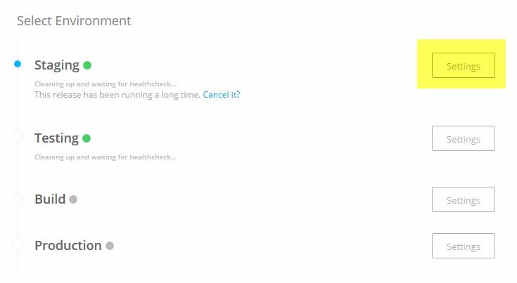

## Shipped - Set the Default Environment

Set the default environment using the environment ID. This default applies to the specified project.

## Set the Default Environment using the UI

1. From the Deploy tab, next to the environment you want to set, click **Settings**.

	
	

	The **Editing Environment** window opens.

2. Check **Auto Deploy**.

Successful builds will now automatically deploy to this environement.

## Set the Default Environment using the API

## Set the Default Environment  using the CLI

To set an environment as default, specify the project and environment IDs, then use *set*.

	environment set <projectId> <environmentId>

