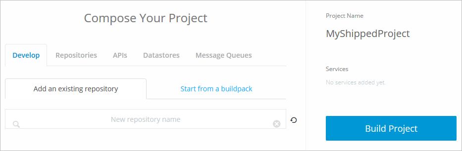
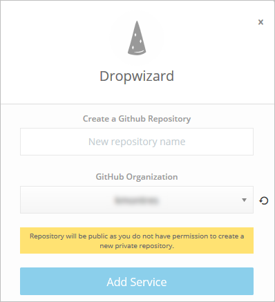
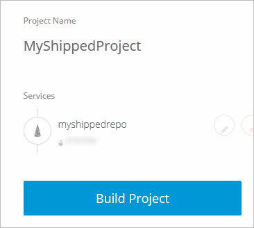
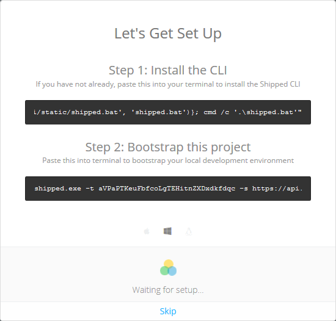

#Managing Projects
A Shipped Project contains all the components you need to publish an app. Before you can create Environments, add Services, or manage Users, you must have a Project.

##Objectives
Completion time: 20 minutes

You will learn how to:

- <a href="#create">Create a Project</a>
- <a href="2.md">Modify a Project</a>
- <a href="3.md">Get a List of Projects</a>
- <a href="4.md">Delete a Project</a>

##Prerequisites

- Completed **Using Shipped the First Time**

##References
You can open these references in a separate tab and refer to them during this Lab.

- <a href="#" target="_blank">Shipped Getting Started Guide</a> 
- <a href="https://cisco.jiveon.com/docs/DOC-811787" target="_blank">High-level view of Shipped</a> 
- Shipped User Guide

#Create a Project

1. Within the Shipped UI, go to **My Projects > Create New Project**.

	The **Create Your Project** form opens.

2. Enter a name for your project, then click **Start Composing**.

	A project name can only consist of letters, numbers, hyphens, and underscores, but no spaces.

	Shipped builds some basic components, then shows the **Compose Your Project** page.

	

3. Click **Start from a Buildpack**, then select **Dropwizard**.

	This lab shows one example, but you can build a project from any buildpack listed.

	The **Dropwizard** form opens.

	

4. Enter a name for the GitHub repository, then click **Add Service**.

	The repository name shows up on the Project page.

	

5. Click **Build Project**.

	Follow the instructions shown in the UI, copying and pasting the commands into the local directory you want to use for your Shipped project.

	This example shows a project created in Windows.

	

	If using windows, install the <a href="https://github.com/Microsoft/Git-Credential-Manager-for-Windows/releases"  target="_blank">Git Credential Manager for Windows</a> into the Shipped directory.

	Shipped automatically downloads and installs apps needed for your project. This might take a couple of minutes.

After creating a project, you can Deploy it.

