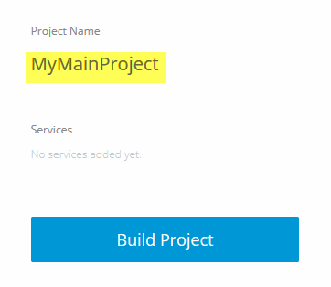

#Modify a Project Description

You can change the description or name of a project.

##Modify a Project using the UI

You can change the Project Name.

1. Select the Project you want to update, then click the Project tab.

	The **Compose Your Project** page appears.

2. Click the Project name, then make the change you want.

	
	

3. Tab out of the field or click anywhere on the page. The project now has a new name.

##Modify a Project using the API

To update a project, provide the project ID and the new project name or description.

For example,

	curl https://api.ciscoshipped.io/projects/183d5961-71f5-11e5-b058-0242ac110238 -H 'Content-type: application/json' -d '{'"name":"myproject"}'

HTTP request:
	
	POST https://api.ciscoshipped.io/projects

##Modify a Project using the CLI

Within the Shipped Console:

To modify a project description, use *update* and provide the project ID and the amended description.
	
	project update 183d5961-71f5-11e5-b058-0242ac110238 description="A sample project"

*-or-*

	pr upd %api desc="A sample project"

