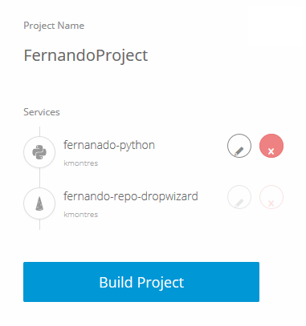

## Shipped - Delete a Service

Deleting a service removes the service and any files it contains.

Deleting an service is permanent and can't be undone.

## Delete a Service using the UI

Deleting a service is permanent and can't be undone.

1. Select your project.

	The **Compose Your Project** page opens.

2. Select the **Add an existing repository** tab.

	The list of services appear.

3. Click the **X** next to the service you want to delete.

	

	The service is now removed..

## Delete a Service  using the API

Deleting a service is permanent and can't be undone.

To delete a service, specify the project and service IDs, then use *DELETE*.

For example,

	curl -X DELETE 'https://api.ciscoshipped.io/projects/183d5961-71f5-11e5-b058-0242ac110238/services/4455979b-66e9-11e5-99e0-0242ac110120'

HTTP request:

	DELETE https://api.ciscoshipped.io/projects/<projectID>/services/<SERVICE_ID>

## Delete a Service  using the CLI

Remember, this action is permanent and can't be undone.

Within the Shipped Console:

To delete a service, navigate to the service directory or specify the project and service IDs, then use *delete*.

	service delete <projectId> <serviceId>

*-or-*

	service delete 183d5961-71f5-11e5-b058-0242ac110238 271c696b-7360-11e5-9240-0242ac11026c

*-or-*

	demo@ubuntu:~/shipped/hello-world $ shipped svc delete

*-or-*

	svc del 183 271

## Next

Go to **Shipped - Bootstrap a Project**.

